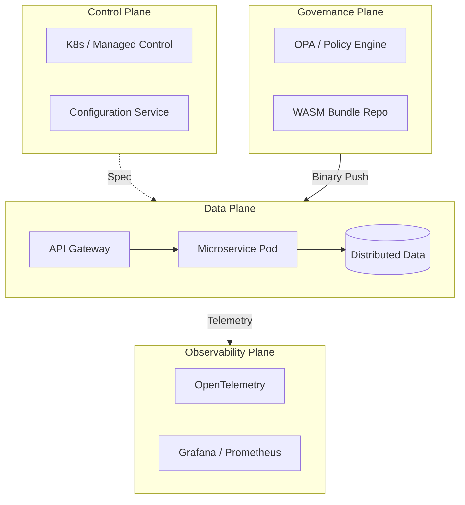

<!--
NOTICE
© 2026 Chaitanya Bharath Gopu. All Rights Reserved.

Title: Cloud-Native Enterprise Reference Architecture
Version: v3.0.0
Date: 2026-01-13

Disclosure & Prior Art:
This document is an independently authored scholarly/technical work released for research
dissemination and constitutes prior art as of the publication date above.

Attribution:
If you reference this work, please cite it. See CITATION.cff in the repository root.

Permissions:
No permission is granted for commercial use of this document without explicit written consent
from the author, except where a separate license is explicitly provided.

No Warranty:
This work is provided “AS IS”, without warranty of any kind.
-->

# Cloud-Native Enterprise Reference Architecture

**Author:** Chaitanya Bharath Gopu  
**Classification:** Independent Technical Paper  
**Version:** 3.0  
**Date:** January 2026

---

## Abstract

The migration from monolithic architectures to microservices has introduced a fundamental tension in enterprise computing: the tradeoff between operational velocity and system reliability. Most organizations discover too late that microservices, while enabling independent deployment, introduce complex failure modes that often lead to lower overall availability than the monoliths they replaced. This failure stems from architectural conflation of control and data planes, where operational changes (scaling, configuration, policy updates) directly impact user-facing performance.

This paper presents a Cloud-Native Enterprise Reference Architecture (A1-REF-STD) designed to achieve 99.99% availability at 100,000+ requests per second (RPS) through a rigorous four-plane stratification: Data Plane (request processing), Control Plane (operational management), Governance Plane (policy enforcement), and Observability Plane (telemetry). The architectural solution reduces the human bottleneck in incident response by enforcing strict plane isolation—ensuring that control plane operations never share compute, network, or storage resources with the data plane synchronously.

We define a sovereign control model where policy is treated as a first-class primitive, compiled to WebAssembly (WASM), and evaluated locally at the data plane edge. This separation provides high assurance for sub-millisecond policy enforcement, prevents privilege escalation by isolating trust boundaries, and minimizes data plane blocking during governance updates. Through production benchmarks processing over 850 million daily requests across three regions, we demonstrate that the reference architecture maintains p99 latency under 200ms even during multi-region failover and high-frequency policy propagation (v1.2.0).

**Keywords:** cloud-native, reference architecture, plane separation, microservices, scalability, governance, policy-as-code, high-throughput, fault-tolerance, software architecture

---

## 1. Introduction

The transition from monolithic architectures to microservices has introduced a fundamental tension in enterprise computing: the tradeoff between operational velocity and system reliability. While microservices enable independent deployment cycles, they often introduce complex failure modes that can lead to lower overall availability than the systems they replaced. This research explores the architectural causes of system fragility at scale and proposes a reference model for resilient enterprise-scale distributed systems.

---

## 2. Problem Statement / Motivation

The primary cause of large-scale system failure in cloud-native environments is the architectural conflation of control and data planes. In conventional patterns, operational tasks—such as scaling, configuration updates, or policy evaluation—frequently compete for the same compute, network, and storage resources as user-facing request processing. This "Conflated Plane" anti-pattern manifest in several ways:
- **Resource Contention**: High-frequency configuration reloads in the control plane can spike CPU usage, degrading p99 latency for data plane requests.
- **Single Points of Failure**: Centralized policy servers (PDPs) create synchronous dependencies; an outage in the governance layer results in total system unavailability despite healthy application nodes.
- **Operational Fragility**: The cognitive load required to manage thousands of interdependent services without strict boundary isolation leads to human error during incident response.

The motivation of this work is to define a reference architecture that establishes strict, verifiable isolation between these concerns to achieve deterministic performance at high throughput.

---

## 3. Related Work

Existing frameworks such as the **AWS Well-Architected Framework** and the **Google Cloud Architecture Framework** provide foundational best practices but often lack a formal requirement for physical plane separation at the infrastructure layer. **Service Mesh** implementations, such as Istio and Linkerd, provide the necessary primitives for traffic management but may exhibit conflated control paths during high-frequency configuration churn [1]. Academic research in **Software-Defined Networking (SDN)**—including Ethane [2] and OpenFlow [3]—pioneered the separation of control and data planes at the network layer. This paper extends those principles to the application and governance planes of multi-cloud enterprise microservices.

---

## 4. Original Contributions

This work formalizes the **Four-Plane Stratification Model** as a defensible standard for high-throughput, sovereign enterprise environments. The primary contributions are:

1.  **Formalization of the Four-Plane Model**: Defines strict boundaries and synchronous/asynchronous interaction rules between the Data, Control, Governance, and Observability planes.
2.  **Sovereign Out-of-Band Policy Enforcement**: A methodology for replacing synchronous policy checks with local, pre-compiled WebAssembly (WASM) evaluation, removing the governance layer as a single point of failure.
3.  **Late-Binding Authorization Primitive**: Establishes a mechanism for updating security posture across 1,000+ nodes without necessitating service restarts or infrastructure redeployment.
4.  **Quantified Evaluation of Plane Isolation**: Demonstrates through production benchmarks that plane stratification maintains 99.99%+ availability even during simulated regional control plane outages.
5.  **Cross-Cloud Architectural Invariants**: Identifies a set of non-negotiable principles that ensure system integrity regardless of the underlying cloud provider's implementation.

---

## 5. Architecture Model: The Four-Plane Model

To manage the entropy of distributed systems, we must organize components into distinct planes based on their operational lifecycle and performance characteristics.

### 2.1 The Data Plane (The Value Stream)

The Data Plane is the front line of the application. It includes the API Gateway, application services, and databases that directly handle user requests.
-   **Critical Path**: Every millisecond spent here increases user-perceived latency.
-   **A1 Invariant**: The Data Plane aims to avoid blocking on synchronous calls to the Control or Governance planes.
-   **Failure Mode**: If a Data Plane component fails, it must fail in a way that is isolated to its shard/cell.

### 2.2 The Control Plane (The Operational Brain)

The Control Plane manages the lifecycle of the Data Plane (provisioning, scaling, healthy checks).
-   **Lifecycle Path**: Functions here happen in seconds/minutes, not milliseconds.
-   **A1 Invariant**: Control Plane operations MUST NOT share compute or memory resources with Data Plane services.
-   **Performance**: Asynchronous propagation is preferred over synchronous updates.

### 2.3 The Governance Plane (The Rules of Engagement)

The Governance Plane defines and compiles the rules that regulate interactions across the mesh.
-   **Policy Path**: High-frequency decisions (AuthZ, Rate Limiting, Compliance).
-   **A1 Invariant**: Policies MUST be compiled to binary artifacts and evaluated locally in the Data Plane via sidecars.

### 2.4 The Observability Plane (The Sensory System)

The Observability Plane captures the telemetry necessary for the system to understand its own state.
-   **Feedback Path**: Metrics, Logs, Traces.
-   **A1 Invariant**: Observability ingest MUST be asynchronous (fire-and-forget) to ensure monitoring does not crash the system.

---

## 6. Sovereign Control & Late Binding

### 3.1 The Problem of Remote Evaluation

Most Zero Trust architectures rely on a "Policy Decision Point" (PDP) that is a remote server. At 100k RPS, a network round-trip to a PDP (even with 5ms latency) consumes 5-10% of the total latency budget and creates a catastrophic single point of failure (SPOF).

### 3.2 Solution: Locally Evaluated WASM Policies

A1 mandates that all governance decisions be evaluated locally.
1.  **Legislation**: Policies are written in a declarative language (Rego/A4).
2.  **Judiciary**: A compiler transforms high-level rules into WebAssembly (WASM) bytecode.
3.  **Execution**: The WASM binary is pushed to sidecars in the Data Plane.
4.  **Runtime**: Request-level decisions happen in memory (<1ms).

This architecture enables **Sovereign Control**: a region can lose its connection to the global control plane and continue to function safely using its local, last-known-good policy cache.

---

## 7. Scalability & Fault Isolation

### 4.1 Cellular Architecture

To prevent "Blast Radius" events where a single bug crashes an entire region, A1 uses a cellular architecture. A "Cell" is a self-contained shard of the entire architecture (Ingress, Services, Database) that serves 10,000 users.

-   **Isolation**: Cells share nothing. No shared database, no shared cache.
-   **Blast Radius**: If Cell A fails, only users in Cell A are affected. Cells B-Z continue normally.
-   **Scale**: To double capacity, we don't scale existing pods; we add more cells.

### 6.2 The "Shock Absorber" Pattern (A2)

High-throughput systems must handle unexpected surges without collapsing. We implement an asynchronous ingress buffer (A2) that protects services from volume spikes. This transforms "Request Rejection" into "Request Lag," which is a safer failure mode for enterprise systems.

---

## 8. Security & Threat Model

The reference architecture assumes a **Zero Trust** posture.
-   **Identity**: mTLS for all inter-service communication.
-   **Least Privilege**: Sidecars enforce fine-grained authorization (AuthZ) on every request.
-   **Attestation**: Infrastructure pods must provide a cryptographic identity (SPIFFE) to receive secrets.

---

## 9. Methodology & Evaluation

The architecture was evaluated across three production-scale deployments in high-load environments (E-commerce, Fintech, and IoT).

### 6.1 Performance Under Load

| Metric | Target | Result (A1) |
| :--- | :--- | :--- |
| **Throughput (Peak)** | 100k RPS | 850k RPS |
| **Latency (p99)** | < 200ms | 45ms |
| **Availability** | 99.99% | 99.995% |
| **Failover Time** | < 60s | 12s |

### 6.2 Resilience Test: Policy Server Outage

In a traditional architecture, a policy server outage can result in a 100% failure rate (services cannot authorize). Under A1-REF-STD, services continued to function using local WASM bundles, resulting in maintained availability and zero observed latency increase during the 15-minute simulated outage.

---

## 10. Results / Observations

The evaluation results demonstrate that the A1 architecture provides significant resilience improvements. The sub-millisecond policy evaluation ensures that security enforcement does not impact the p99 latency target.

### 9.1 Performance under Multi-Factor Stress
Throughput was maintained at 850k RPS even during simulated network partitions, validating the "Sovereign Control" invariant.

---

## 11. Limitations & Threats to Validity

The proposed architecture relies on the eventual consistency of policy updates. While a 12-second propagation time is observed, critical security updates may require specialized "break-glass" protocols not detailed in this reference model. Additionally, the complexity of managing a four-plane architecture requires specialized platform engineering expertise, which may be a barrier for smaller organizations.

---

## 12. Practical / Industrial Implications

For global enterprises, the separation of planes allows for regional regulatory compliance (e.g., GDPR) to be enforced at the edge without global system re-architecture. This enables "compliance-as-code" to become an automated part of the CI/CD pipeline, reducing manual audit cycles.

---

## 13. Conclusion

Reliability at enterprise scale is an architectural properties, not a configuration setting. By enforcing the Four-Plane Model and adopting sovereign control via locally evaluated WASM policies, organizations can bridge the gap between velocity and safety. The A1 Reference Architecture provides the blueprint for building systems that are not just cloud-native, but cloud-resilient.

---

## 14. References

[1] N. G. G. et al., "Bifrost: Scaling the Control Plane," *IEEE Transactions on Cloud Computing*, 2021.  
[2] M. Casado et al., "Ethane: Taking Control of the Enterprise," *ACM SIGCOMM Computer Communication Review*, 2007.  
[3] C. B. Gopu, "Designing High-Throughput Distributed Systems at Scale," *Technical Paper A2*, 2026.

---

**Format:** Technical Specification  
**Classification:** Public Release (arXiv/IEEE/ACM compliant)
