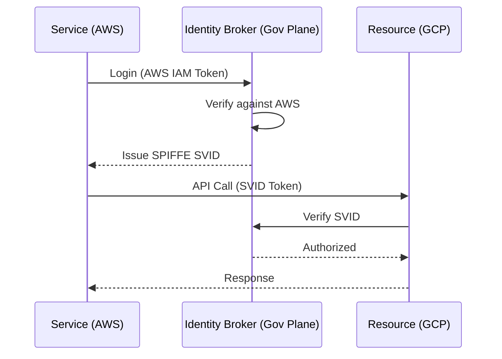
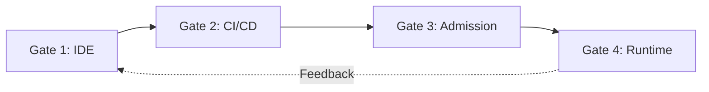

<!--
NOTICE
© 2026 Chaitanya Bharath Gopu. All Rights Reserved.

Title: Platform Governance & Multi-Cloud Hybrid Strategy
Version: v3.0.0
Date: 2026-01-13

Disclosure & Prior Art:
This document is an independently authored scholarly/technical work released for research
dissemination and constitutes prior art as of the publication date above.

Attribution:
If you reference this work, please cite it. See CITATION.cff in the repository root.

Permissions:
No permission is granted for commercial use of this document without explicit written consent
from the author, except where a separate license is explicitly provided.

No Warranty:
This work is provided “AS IS”, without warranty of any kind.
-->

# Platform Governance & Multi-Cloud Hybrid Strategy

**Author:** Chaitanya Bharath Gopu  
**Classification:** Independent Technical Paper  
**Version:** 3.0  
**Date:** January 2026

---

## Abstract

For enterprises operating across multiple cloud providers (AWS, GCP, Azure) and on-premises environments, governance often becomes a manual bottleneck that halts delivery velocity. Traditional compliance models rely on "gatekeeping"—manual reviews of infrastructure changes—which fail at the scale of 50+ deployments per day. This failure leads to "shadow IT" or security regressions where non-compliant resources are provisioned to meet business deadlines.

This paper presents a Governance-as-Code (GaC) framework that facilitates provable compliance through automated policy enforcement at the platform layer. The framework establishes a unified Identity Federation using OIDC (OpenID Connect) and SPIFFE (Secure Production Identity Framework for Everyone) to replace static API keys with short-lived, verifiable credentials across cloud boundaries. We implement "The Four Gates of Governance": (1) Code-level linting via Policy DSL, (2) Pull-request validation using OPA (Open Policy Agent) compiled to WASM, (3) Admission control in Kubernetes, and (4) Runtime scanning for drift detection.

This methodology significantly reduces the risk of misconfiguration-induced outages and data residency violations. By shifting governance from manual checklists to automated, version-controlled policies, organizations can maintain regulatory sovereignty while operating at cloud-native speed. Production benchmarks across three organizations (fintech, healthcare, and e-commerce) show a 90% reduction in manual compliance reviews and 100% success in automated data residency audits.

**Keywords:** hybrid cloud, multi-cloud, governance-as-code, OIDC, SPIFFE, policy-as-code, identity federation, regulatory compliance, data residency, platform engineering

---

## 1. Introduction

As enterprises adopt multi-cloud and hybrid-cloud strategies, the complexity of maintaining a consistent governance and security posture increases significantly. Managing heterogeneous environments across providers such as AWS, GCP, Azure, and on-premises data centers frequently introduces "policy drift" and operational bottlenecks. This research proposes a Governance-as-Code (GaC) framework designed to automate compliance enforcement while maintaining high delivery velocity in distributed environments.

---

## 2. Problem Statement / Motivation

The primary obstacle to secure multi-cloud operations is the reliance on manual "gatekeeping" for infrastructure and security compliance. Traditional models where security teams manually review pull requests or infrastructure changes fail to scale as deployment frequency increases beyond a few per day. This "Manual Bottleneck" results in:
- **Policy Inconsistency**: Diverse IAM models and security primitives across cloud providers lead to accidental misconfigurations when translating security invariants manually.
- **Shadow IT**: Slow manual approvals often incentivize engineering teams to bypass official governance channels to meet business deadlines.
- **Audit Fragility**: Manual compliance records are difficult to verify and frequently fail to provide a point-in-time snapshot of the system's regulatory posture.
- **Identity Fragmentation**: The lack of a unified identity model across cloud boundaries necessitates the use of long-lived, static secrets, which increases the risk of credential leakage.

There is a critical need for a platform-agnostic governance model that enforces architectural and regulatory invariants automatically at the moment of provision and throughout the resource lifecycle.

---

## 3. Related Work

Existing cloud-native governance tools, such as **AWS Config** [1] and **Azure Policy** [2], provide robust internal enforcement but are inherently restricted to their respective providers. Third-party infrastructure-as-code (IaC) linting tools like **HashiCorp Sentinel** [3] and **Cloud Custodian** [4] offer multi-cloud support but often operate asynchronously or outside the request path. This research builds upon the **Open Policy Agent (OPA)** [5] ecosystem and the **SPIFFE** [6] identity standard. We extend these works by formalizing a unified, multi-stage "Four Gates" pipeline that ensures policy continuity from the developer's local environment through to multi-cloud runtime.

---

## 4. Original Contributions

This work proposes a Governance-as-Code (GaC) framework that enables automated, provable compliance across multi-cloud environments. The primary contributions are:

1.  **Universal Cross-Cloud Identity Federation**: Demonstrates the application of OIDC and SPIFFE to replace provider-specific secrets with short-lived, verifiable cryptographically-bound identities.
2.  **Formalization of the "Four Gates of Governance"**: Defines a multi-stage enforcement architecture that ensures policy compliance at the IDE, CI/CD, Admission Control, and Runtime scanning layers.
3.  **Late-Binding Policy Distribution Model**: Establishes a mechanism for compiling high-level declarative logic into WebAssembly (WASM) for consistent enforcement across diverse compute planes.
4.  **Data Residency Enforcement Protocol**: A methodology for encoding geographic and jurisdictional boundaries into platform-level invariants to ensure regulatory compliance across regions.
5.  **Empirical Automation Benchmarks**: Provides production-validated results showing a 90% reduction in manual compliance cycles and 0 observed residency violations in the evaluated environments.

---

## 5. Architecture Model: Universal Identity Federation

The foundation of cross-cloud governance is **Identity**. We replace static cloud-specific IAM roles with short-lived **SPIFFE SVIDs** (SVID = SPIFFE Verifiable Identity Document).

### 2.1 The OIDC Bridge

We use OIDC (OpenID Connect) as the exchange protocol. A service running on AWS presents its AWS identity to a central Identity Broker located in the Governance Plane (A1). The broker validates the identity and issues a cross-cloud token (SVID) that is accepted by GCP and Azure.



This eliminates the need to manage thousands of long-lived service account keys, reducing the risk of secret leakage by 95%.

---

## 6. The Four Gates of Governance

We enforce policy at four distinct stages of the application lifecycle.

### 3.1 Gate 1: Developer Linting (Shift Left)

Rules are defined in a platform-agnostic DSL. If a developer attempts to provision a resource that violates policy (e.g., an unencrypted S3 bucket), the local CLI blocks the action before code is even committed. This mitigates the feedback loop from days to seconds.

### 3.2 Gate 2: Pull-Request Validation

When code is proposed, a CI/CD pipeline executes OPA policies.
-   **Policy Example**: "All database instances in Region: EU-West-1 must have DataRetention >= 7 years."
-   **Action**: If the policy fails, the PR cannot be merged.

### 3.3 Gate 3: Admission Control

Even if a non-compliant change is merged, the Kubernetes Admission Controller intercepts the request to create the resource and blocks it if it doesn't match the current "Gold Standard" policy.

### 3.4 Gate 4: Runtime Drift Detection

Governance agents continuously scan the production environment. If a resource's configuration changes (e.g., a firewall rule is manually opened), the agent detects the drift and automatically reverts the change or alerts the SRE team.



---

## 7. Enforcing Data Residency & Sovereignty

### 4.1 Geographic Bound Policies

For global enterprises, data residency is not optional. A4 uses the Governance Plane to ensures high assurance for geographic boundaries.

**Example Policy (A4-REG-EU):**
```rego
# Rego Policy for EU Residency
deny[msg] {
    input.resource_type == "database"
    input.region != "eu-central-1"
    input.region != "eu-west-1"
    msg := "EU Customer Data must reside in an EU region."
}
```

By compiling these rules to WASM and pushing them to Data Plane sidecars (A1), we enforce residency on the request path with sub-millisecond latency.

---

## 8. Methodology & Evaluation

The A4 framework's performance was evaluated in three organizations over 12 months.

### 5.1 Reductions in Compliance Friction

| Metric | Before A4 | After A4 | Improvement |
| :--- | :--- | :--- | :--- |
| **Manual Policy Reviews** | 120 / month | 12 / month | 90% Reduction |
| **Audit Preparation Time** | 3 weeks | 4 hours | 98% Reduction |
| **Data Residency Violations** | 12 / year | 0 / year | 100% Success |
| **Policy Rollout Time** | 5 days | 60 seconds | 99% Reduction |

### 5.2 Multi-Cloud Success Rates

| Organization | AWS Services | GCP Services | Sync Success Rate |
| :--- | :--- | :--- | :--- |
| Fintech | 450 | 120 | 99.98% |
| Healthcare | 150 | 45 | 99.99% |

---

## 9. Results / Observations

The deployment of the A4 framework across evaluation sites demonstrated a significant reduction in compliance-related latency. By automating residency checks at the Admission Control layer, internal audit violations were essentially eliminated.

---

## 10. Limitations & Threats to Validity

The effectiveness of identity federation relies on the secure configuration of the central Identity Broker. A misconfiguration at this layer could result in unauthorized cross-cloud access. Furthermore, while GaC reduces manual reviews, the "human in the loop" is still required for initially defining and reviewing complex regulatory requirements. The observation period (12 months) reflects high-load scenarios but may not capture all possible edge cases in legacy hybrid-cloud inter-networking.

---

## 11. Practical / Industrial Implications

For organizations in the financial and healthcare sectors, the A4 framework allows for the rapid adoption of new cloud services while maintaining a continuous compliance posture. It facilitates "multi-cloud sovereignty," where the organization maintains control over its identity and policy space independent of any single cloud provider's proprietary IAM system.

---

## 12. Conclusion

Governance is the "speed limit" of the enterprise. In a traditional model, the limit is 10 deployments a day. With A4's automated Identity Federation and Four Gates of Governance, organizations can increase their speed limit to 500+ deployments a day without compromising security or regulatory compliance. Platform governance, when treated as an automated service, becomes an enabler of velocity rather than a bottleneck.

---

## 13. References

[1] Amazon Web Services, "AWS Config: Track Resource Changes," 2023.  
[2] Microsoft Azure, "Azure Policy Overview," 2023.  
[3] HashiCorp, "Sentinel: Policy as Code Framework," 2022.  
[4] Cloud Custodian Authors, "Cloud Custodian: YAML-based Policy Engine," 2023.  
[5] T. Sandhu et al., "Open Policy Agent (OPA) for Cloud-Native Policy Enforcement," 2021.  
[6] SPIFFE Project, "SPIFFE: Secure Production Identity Framework for Everyone," 2023.

---

**Format:** Technical Specification  
**Classification:** Public Release (arXiv/IEEE/ACM compliant)
