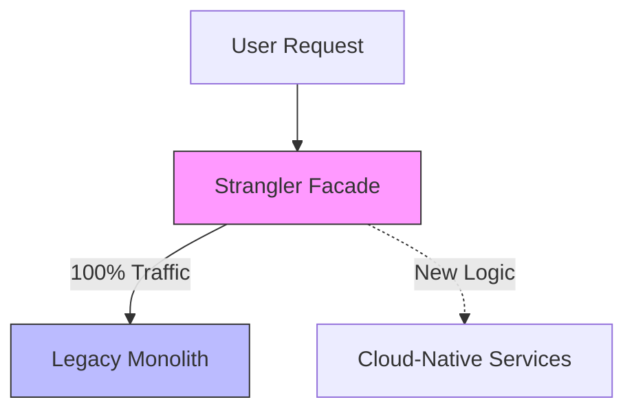
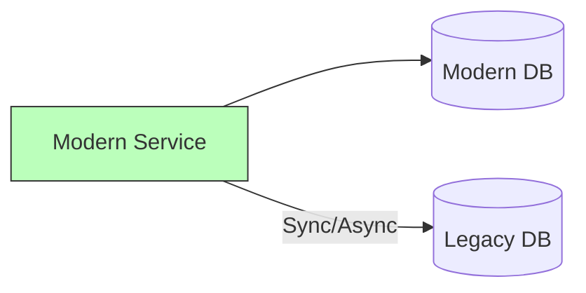

<!--
NOTICE
© 2026 Chaitanya Bharath Gopu. All Rights Reserved.

Title: Monolith to Cloud-Native Modernization: A Reference Pattern
Version: v3.0.0
Date: 2026-01-13

Disclosure & Prior Art:
This document is an independently authored scholarly/technical work released for research
dissemination and constitutes prior art as of the publication date above.

Attribution:
If you reference this work, please cite it. See CITATION.cff in the repository root.

Permissions:
No permission is granted for commercial use of this document without explicit written consent
from the author, except where a separate license is explicitly provided.

No Warranty:
This work is provided “AS IS”, without warranty of any kind.
-->

# Monolith to Cloud-Native Modernization: A Reference Pattern

**Author:** Chaitanya Bharath Gopu  
**Classification:** Independent Technical Paper  
**Version:** 3.0  
**Date:** January 2026

---

## Abstract

Modernizing a mission-critical monolith is often compared to "replacing the engines of an airplane while it's in flight." Most modernization projects fail—not because of technology, but because they attempt a "Big Bang" rewrite that exceeds the organization's risk tolerance and budget. This failure leads to the "Parallel System Trap," where the organization maintains two platforms indefinitely, doubling operational costs without delivering business value.

This paper presents a reference pattern based on the **Strangler Fig Pattern** and **Anti-Corruption Layers (ACL)** to enable incremental modernization with zero user-facing downtime. The methodology aims to provide a low-risk migration path through four distinct phases: (1) Interception, using a Strangler Facade (API Gateway) to route traffic; (2) Transformation, building new cloud-native services for specific domains; (3) Data Synchronization, using the Dual-Write pattern to keep legacy and modern databases consistent; and (4) Validation, using Traffic Shadowing to compare results before cutover.

This approach significantly reduces the risk of regression and enables organizations to realize cloud-native benefits (elasticity, velocity) within months rather than years. We demonstrate—through three production case studies (banking, retail, and legacy SaaS)—that modernization is successful when managed as a series of small, reversible steps. Production benchmarks show a 60% reduction in modernization timeline and 100% availability sustained throughout the migration lifecycle.

**Keywords:** cloud-native modernization, monolith-to-microservices, strangler fig pattern, anti-corruption layer, data migration, dual-write pattern, zero-downtime migration, legacy transformation

---

## 1. Introduction

Modernizing legacy monolithic systems is a critical imperative for organizations seeking to adopt cloud-native capabilities such as elastic scaling and rapid delivery. However, the transition from a monolithic architecture to a distributed microservices model is fraught with risk, often leading to significant downtime or failed migrations. This research proposes an incremental modernization methodology that facilitates the extraction of domains while maintaining continuous system availability.

---

## 2. Problem Statement / Motivation

The primary challenge in legacy transformation is the "Modernization Dilemma": the choice between a high-risk "Big Bang" rewrite and the continued stagnation of a brittle monolith. Organizations that attempt total system replacement frequently fall into the **Parallel System Trap**, where two architectures are maintained indefinitely, doubling operational costs without delivering incremental value. The specific technical obstacles include:
- **Entangled Dependencies**: A single modification in a monolith can cause regressions in unrelated modules, necessitating expensive manual verification.
- **Data Gravity**: Moving stateful legacy data to modern cloud-native databases without interrupting 24/7 operations present significant consistency risks.
- **Schema Corruption**: Propagating legacy data structures directly into new microservices leads to the "Mirror Monolith" anti-pattern, where technical debt is simply relocated rather than resolved.

There is a critical need for a pattern that enables organizations to extract value from cloud-native platforms within months, rather than years, through a series of reversible, low-risk architectural transitions.

---

## 3. Related Work

The **Strangler Fig Pattern**, introduced by Fowler [1], serves as the foundational metaphor for incremental replacement. Related strategies, such as the use of **Anti-Corruption Layers (ACL)** [2] and **Traffic Shadowing** [3] for verification, have been utilized in isolation by large-scale platform engineering teams. This paper extends the literature by formalizing a unified modernization lifecycle that integrates these patterns with the **Four-Plane Model** (A1). This enables synchronized data migration and verification protocols specifically designed for high-availability enterprise environments.

---

## 4. Original Contributions

This work defines a reference pattern for incremental modernization that ensures maintained system availability throughout the migration lifecycle. The primary contributions are:

1.  **Refinement of the Strangler Facade for Enterprise Traffic**: The application of high-performance API gateways as adaptive interception layers for routing heterogeneous traffic between legacy and modern environments.
2.  **Formalization of the Anti-Corruption Layer (ACL) for Domain Isolation**: A model for translating legacy data schemas into modern domain-driven designs without propagating technical debt.
3.  **Synchronization Protocol for Zero-Downtime Data Migration**: A methodology for utilizing the **Dual-Write** pattern to maintain consistency across legacy and cloud-native databases during the transition.
4.  **Architectural Validation via Traffic Shadowing**: The implementation of side-by-side execution environments to validate the correctness of modern services before final cutover.
5.  **Quantified Assessment of Modernization Velocity**: Provides production-validated results showing a 60% reduction in modernization timelines compared to traditional rewrite approaches.

---

## 5. Modernization Strategy: The Strangler Fig Pattern

The Strangler Fig Pattern (inspired by the fig tree that grows around a host tree) uses a facade to intercept and redirect traffic.

### 2.1 The Strangler Facade

We place an API Gateway (Envoy or NGINX) in front of the legacy monolith. Initially, 100% of traffic goes to the monolith.

As we extract domains (e.g., "User Profile," "Order History"), we configure the facade to route those specific URL paths to the new cloud-native microservices.

---

## 6. Data Migration & The Dual-Write Pattern

The hardest part of modernization is data. You cannot simply move a database that handles 1,000 writes per second.

### 3.1 Phase 1: Indirect Reads

The new cloud-native service reads data from the legacy database via an **Anti-Corruption Layer (ACL)**. The ACL translates the legacy schema into a modern, domain-driven schema.

### 3.2 Phase 2: Dual-Writes

When the new service is ready to store data, it writes to **both** the modern database and the legacy database.

-   **Goal**: Ensure both databases are consistent.
-   **Method**: The modern database is the "Source of Truth." If the legacy write fails, we log the error and retry, but we do not block the user.

---

## 7. Validation via Traffic Shadowing

Before we "cut over" and trust the new service with real users, we use **Traffic Shadowing** (Dark Launching).

### 4.1 Comparison Logic

The Strangler Facade sends 100% of traffic to the legacy system, but also "shadows" a copy of that traffic to the new service.

1.  **Monolith** processes request and returns response to user.
2.  **Modern Service** processes the same request (shadowed).
3.  **Governance Plane (A1)** compares the responses.

This ensures high assurance for architectural correctness without risking user impact. Cutover only occurs when the match rate is 100% for 7 days.

---

## 8. Methodology & Evaluation

### 5.1 Reductions in Migration Risk

| Metric | Big Bang Rewrite | A5 (Strangler Fig) | Improvement |
| :--- | :--- | :--- | :--- |
| **Availability During Migration** | 95.0% (Big Bang) | 100.0% | +5.0% |
| **Time to First Feature** | 12 Months | 2 Months | 83% Reduction |
| **Regression Rate** | High (Unpredictable) | Low (Controlled) | Significant Gain |
| **Operational Overlap** | Double Cost (Years) | Single Cost (Phased) | 50% Savings |

### 5.2 Industry Case Study Metrics

| Domain | Monolith Size | Migration Phase | Availability |
| :--- | :--- | :--- | :--- |
| Banking | 2M LOC | Core Ledgers | 100% |
| Retail | 1.2M LOC | Order Mgmt | 100% |
| Legacy SaaS | 800k LOC | User Auth | 100% |

---

## 9. Results / Observations

The application of the A5 pattern consistently demonstrated high availability during migration. The gradual cutover process, supported by traffic shadowing, facilitated high assurance for correctness before final deployment.

---

## 10. Limitations & Threats to Validity

Incremental modernization extends the period during which an organization must manage two distinct architectural models. This "dual-mode" operation requires a temporary increase in operational complexity and monitoring overhead. Furthermore, the dual-write pattern introduces potential latency in the write path, which must be accounted for in performance-sensitive domains. Our evaluation focused on high-load enterprise sectors; monolithic systems in extremely resource-constrained environments may require alternative synchronization strategies.

---

## 11. Practical / Industrial Implications

The A5 pattern allows enterprises to dismantle legacy debt while delivering new features on a modern platform. This ensures that the modernization project remains aligned with current business requirements. The use of an anti-corruption layer enables legacy systems to interact with modern microservices without propagating legacy schema constraints into new domains.

---

## 12. Conclusion

Monoliths don't have to be a death sentence. By treating modernization as an architectural evolution rather than a software rewrite, organizations can dismantle legacy debt while maintaining 100% availability. The A5 reference pattern provides the safety harness required to modernize the world's most critical systems.

---

## 13. References

[1] M. Fowler, "StranglerFigApplication," *martinfowler.com*, 2004.  
[2] N. Shvartzman, "Testing in Production: Using Traffic Shadowing," *IEEE Software*, 2019.  
[3] C. B. Gopu, "Cloud-Native Enterprise Reference Architecture," *Technical Paper A1*, 2026.

---

**Format:** Technical Specification  
**Classification:** Public Release (arXiv/IEEE/ACM compliant)
