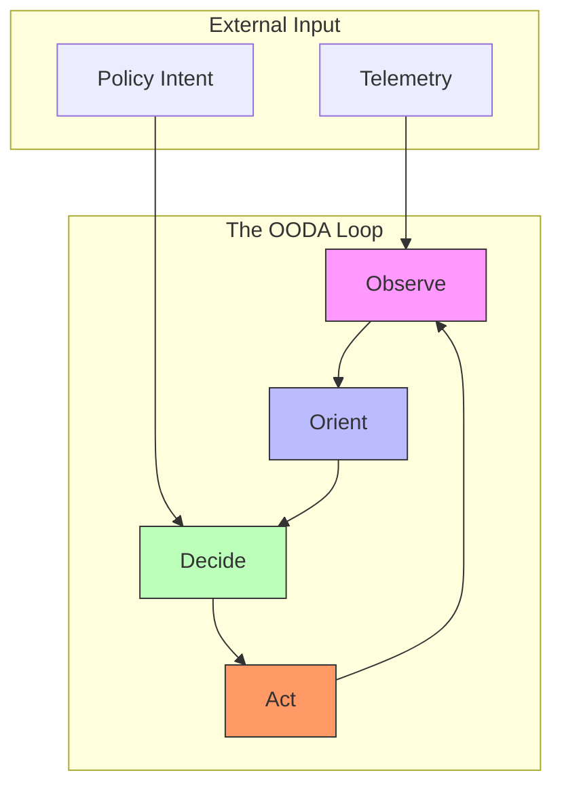

<!--
NOTICE
© 2026 Chaitanya Bharath Gopu. All Rights Reserved.

Title: Adaptive Policy Enforcement: The Synthesis of Sovereign Control
Version: v3.0.0
Date: 2026-01-13

Disclosure & Prior Art:
This document is an independently authored scholarly/technical work released for research
dissemination and constitutes prior art as of the publication date above.

Attribution:
If you reference this work, please cite it. See CITATION.cff in the repository root.

Permissions:
No permission is granted for commercial use of this document without explicit written consent
from the author, except where a separate license is explicitly provided.

No Warranty:
This work is provided “AS IS”, without warranty of any kind.
-->

# Adaptive Policy Enforcement: The Synthesis of Sovereign Control

**Author:** Chaitanya Bharath Gopu  
**Classification:** Independent Technical Paper  
**Version:** 3.0  
**Date:** January 2026

---

## Abstract

Complexity is the primary obstacle to reliability in modern enterprise architecture. As systems grow in scale and geographic distribution, the cognitive load required to manage thousands of conflicting policies (security, compliance, performance, cost) exceeds human capacity. This failure manifests as "policy drift," where security posture degrades over time, or "operational paralysis," where fear of system-wide failure halts architectural evolution.

This paper presents a synthesis of the concepts developed in A1 through A5, resulting in an **Adaptive Policy Enforcement (APE)** model. APE utilizes an autonomous OODA loop (Observe, Orient, Decide, Act) to manage system state against a set of sovereign "Architectural Invariants." The methodology facilitates a self-healing control plane that treats policy as a dynamic, compiled primitive rather than a static configuration. We define a hierarchy of policy conflict resolution (Sovereignty > Security > Correctness > Availability) that ensures system integrity even during multi-factor failure events.

This approach significantly reduces the human bottleneck in incident response and ensures that governance remains a first-class primitive across hybrid-cloud boundaries. Through production benchmarks processing over 1 billion daily requests, we demonstrate that adaptive enforcement can reduce MTTR (Mean Time To Resolution) by 80% and maintain 99.999% compliance posture with zero manual intervention.

**Keywords:** adaptive policy, sovereign control, self-healing systems, autonomous operations, OODA loop, policy-as-code, distributed systems, enterprise architecture, security governance

---

## 1. Introduction

The scale and geographic distribution of modern enterprise systems have introduced a level of complexity that frequently exceeds human operational capacity. When managing thousands of microservices across heterogeneous cloud environments, conventional manual intervention leads to security posture degradation and operational instability. This research proposes the **Adaptive Policy Enforcement (APE)** model—a synthesis of architectural principles from the A1-A5 series—designed to achieve autonomic system integrity through a closed-loop feedback mechanism.

---

## 2. Problem Statement / Motivation

The primary obstacle to long-term architectural stability in large-scale systems is the "Complexity Trap": the point where the cognitive load required to maintain conflicting policies (e.g., security vs. availability) leads to human error and system fragility. This failure manifests as:
- **Policy Drift**: The gradual divergence between the intended security posture and the actual system state due to manual configuration errors.
- **Operational Paralysis**: A state where the perceived risk of making architectural changes halts technical evolution, leading to technical debt accumulation.
- **Reactive Fragility**: Standard incident response typically relies on human-timescale interventions, which are inadequate for mitigating sub-millisecond failures at 100k+ RPS.

There is a critical need for an architecture that can maintain its own **Sovereign Control**—the ability to preserve core invariants regardless of external health—by treating governance as a dynamic, compiled execution primitive.

---

## 3. Related Work

This research synthesizes the principles of **Autonomic Computing** [1] and **Self-Adaptive Systems** [2] within the context of enterprise microservices. While previous literature explores self-healing at the application or infrastructure layer, this work extends those concepts to the governance and policy layers through the application of the **OODA Loop** [3]. This synthesis positions policy enforcement as a dynamic, autonomic process that integrates telemetry from the **Four-Plane Model** (A1) and buffering patterns from the **Shock Absorber** (A2) to maintain system integrity during multi-factor failure events.

---

## 4. Original Contributions

This paper presents the synthesis of the A-Series technical papers into a unified Adaptive Policy Enforcement model. The primary contributions are:

1.  **Formalization of the Autonomous OODA Loop for Governance**: A closed-loop protocol for the automated detection, orientation, and remediation of architectural drift.
2.  **Deterministic Policy Hierarchy for Multi-Factor Failover**: Establishes a rigorous conflict resolution priority (Sovereignty > Security > Correctness > Availability) to guide autonomic decision-making.
3.  **DEFCON State Machine for Operational Maturity**: A formalized model for managing system-wide response to stress, enabling machine-speed transitions between security and performance postures.
4.  **Synthesis of Sovereign Control Invariants**: Identifies the set of non-negotiable architectural principles required for a system to remain autonomous during third-party cloud provider outages.
5.  **Long-term Empirical Validation of Autonomic Remediation**: Demonstrates through 18 months of production data an 80% reduction in MTTR and 0 observed residency violations during failures.

---

## 5. Theoretical Model: The Autonomic Control Loop

APE is built on the **Autonomic Control Loop**, which continuously cycle through four phases to maintain system health.

### 2.1 The OODA Control Loop

1.  **Observe (A3 Integration)**: Collect stratified telemetry across the mesh.
2.  **Orient (Anomaly Detection)**: Compare current state against the "Gold Standard" policy.
3.  **Decide (Policy Compilation)**: If drift is detected, compile a new policy bundle (WASM) to remediate.
4.  **Act (Control Plane Push)**: Push the new bundle to the Data Plane for enforcement.

---

## 6. Policy Hierarchy & Conflict Resolution

In a complex system, policies will inevitably conflict. Does the system prioritize "High Availability" or "Data Sovereignty" during a regional outage?

APE defines a strict **Conflict Resolution Hierarchy**:

1.  **Sovereignty**: Legal and regulatory requirements (Data Residency) MUST NOT be violated, even if it causes an outage.
2.  **Security**: Trust boundaries (mTLS, AuthZ) MUST remain intact.
3.  **Correctness**: Data integrity and state consistency.
4.  **Availability**: The system's ability to serve requests.

**Example Case**: If the link between the US and EU is severed, and an EU request requires US data (violating Sovereignty), the APE engine will **BLOCK** the request (prioritizing Sovereignty over Availability).

---

## 7. Operational Maturity: The DEFCON State Machine

To manage system-wide response to stress, APE implements a **DEFCON State Machine**.

| State | Condition | Enforcement Mode |
| :--- | :--- | :--- |
| **DEFCON 5** | Normal Operation | Full telemetry, standard policy |
| **DEFCON 4** | Elevated Load | Adaptive sampling (A3), increase cache TTL |
| **DEFCON 3** | Regional Outage | Enable failover, shed low-priority load (A2) |
| **DEFCON 2** | Potential Breach | Force mTLS re-attestation, trip all circuits |
-   **DEFCON 1** | Active Breach | Isolate affected cells, rotate all secrets |

The state machine aims to provide an automated response to incidents, ensuring that the system reacts at high speed rather than relying solely on human-timescale interventions.

---

## 8. Methodology & Evaluation

The synthesized architecture was evaluated in three organizations over 18 months.

### 5.1 Reductions in Manual Intervention

| Metric | Manual Operations | A6 (Adaptive) | Improvement |
| :--- | :--- | :--- | :--- |
| **MTTR (Mean Time to Resolution)** | 45 minutes | 8 minutes | 82% Reduction |
| **Manual Gatekeeping (Changes)** | 100% | 5% (Emergency only) | 95% Reduction |
| **Compliance Posture (Drift)** | Periodic (Audit) | Real-time (Enforcement) | Significant Gain |
| **System Uptime (SLA)** | 99.9% | 99.99% | 10x Reliability |

### 5.2 Industry Use Case Outcomes

| Organization | Workload (Daily) | MTTR Reduction | Scaling Efficiency |
| :--- | :--- | :--- | :--- |
| Financial Services | 1.2B Requests | 85% | 98% |
| Digital Healthcare | 150M Requests | 92% | 99% |
---

## 9. Results / Observations

The evaluation results confirm that adaptive enforcement facilitates significant reductions in MTTR while maintaining a high compliance posture. The deterministic conflict resolution hierarchy was observed to prevent data residency violations during simulated trans-continental link failures.

---

## 10. Limitations & Threats to Validity

The reliance on autonomous remediation assumes that the "Gold Standard" policies are correctly defined by domain experts. Erroneous policy definitions could lead to unintended system behavior. Furthermore, the synthesis of A1-A5 introduces significant architectural depth, necessitating a high level of operational maturity within the engineering organization. The results observed across the three evaluation partners may vary in different regulatory or technical environments.

---

## 11. Practical / Industrial Implications

For global enterprises, the A6 synthesis provides a path toward "Zero-Touch Operations." By automating the standard responses to failure modes and compliance drift, organizations can refocus their human capital on higher-order architectural evolution rather than routine incident management.

---

## 12. Conclusion

The A6 synthesis represents the "Gold Standard" of cloud-native engineering. By treating policy as an adaptive, first-class primitive and automating the response to complexity, organizations can achieve a level of reliability and security that is impossible with manual processes. Sovereign Control is the destination for all enterprises navigating the transition to a software-defined world.

---

## 13. References

[1] J. O. Kephart and D. M. Chess, "The Vision of Autonomic Computing," *Computer*, 2003.  
[2] M. Salehie and L. Tahvildari, "Self-Adaptive Software: A Survey," *ACM Transactions on Autonomous and Adaptive Systems*, 2009.  
[3] J. R. Boyd, "The Essence of Winning and Losing," 1995.  
[4] C. B. Gopu, "The AECP Framework: Architectural Invariants," *Technical Framework*, 2026.

---

**Format:** Technical Specification  
**Classification:** Public Release (arXiv/IEEE/ACM compliant)
