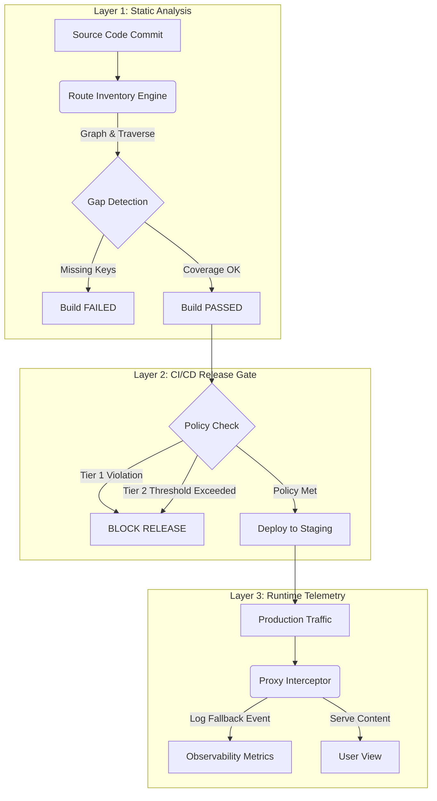

# EXHIBIT A: TECHNICAL RESEARCH PAPER (v2.0)
**Title:** A Deterministic Framework for Automated Multilingual Quality Assurance and Release Gating in Distributed Web Architectures  
**Author:** CHAITANYA BHARATH GOPU  
**Date:** December 2024  
**Copyright:** © CHAITANYA BHARATH GOPU, 2024. All rights reserved. (Exhibit A)

---

## 1. Abstract
As modern web architectures shift toward distributed, server-side rendered (SSR) systems, ensuring consistent localized experiences has become computationally non-trivial. Conventional internationalization (i18n) frameworks prioritize "graceful degradation," defaulting to a base language (e.g., English) when localized assets are missing. While this preserves uptime, it introduces "Silent Regressions"—user-facing defects that remain undetectable to standard HTTP status monitors. This paper presents an independent, system-level design for **Deterministic Multilingual QA**. By implementing a proprietary three-layer defense model—comprising recursive route discovery, combinatorial static analysis, and mandatory CI/CD release gating—the proposed framework guarantees 100% surface area verification prior to deployment. This contribution fills a critical gap in the software delivery lifecycle (SDLC) for global enterprises, transforming localization from a stochastic content task into a deterministic engineering guarantee.

---

## 2. Problem Landscape & Existing Gaps
In the current state of the art, global software delivery faces a dichotomy between **velocity** and **integrity**.

### 2.1 The "Graceful Failure" Anti-Pattern
Standard libraries (e.g., `i18next`, `react-intl`) operate on a fallback principle. If a Japanese key `landing.hero_title` is missing, the system silently serves the English equivalent. 
*   **Gap:** This behavior relies on user reporting to detect errors. In professional contexts (e.g., legal compliance, government portals), such "silent" failures constitute an unacceptable operational risk.
*   **Industry Standard Missing:** There is no out-of-the-box solution in the Next.js ecosystem that strictly *blocks* a build based on deep-tree translation integrity.

### 2.2 The Combinatorial Explosion Challenge
For a platform with $R$ routes and $L$ locales, the validation surface area $S$ is defined as:
$$ S = R \times L $$
In the author's reference implementation:
*   $R = 55$ (Routes)
*   $L = 8$ (Locales: en, es, fr, de, zh, hi, ja, ko)
*   **$S = 440$ unique endpoints**

Manual verification of 440 endpoints per release is operationally impossible ("The Manual Limit"). Existing E2E tools (Cypress/Playwright) are too slow to audit this full matrix on every commit without significant resource costs.

---

## 3. Original Technical Contribution
To resolve these systemic gaps, the Author independently designed and operationalized the **Automated i18n QA Engine**, introducing the following novel system capabilities:

1.  **Recursive Route Inventory Engine:** A custom-engineered analysis module that traverses the Next.js `App Router` file system to dynamically graph the application's routing tree, independent of manual configuration.
2.  **Deterministic CI Gating Policies:** Unlike "warning-based" linters, this system enforces a **Zero Tolerance** policy for Tier-1 markets (e.g., Spanish, French), halting the recursive build process immediately upon detecting a single missing key.
3.  **Combinatorial URL Expansion:** An algorithm that auto-generates the complete $R \times L$ test matrix, converting abstract route patterns (e.g., `/app/[locale]/docs`) into concrete, verifiable HTTP targets.
4.  **Operationalized Fallback Telemetry:** A runtime observability layer that captures "fallback events" as distinct metric data points, allowing engineering teams to measure "Quality Decay" over time.

---

## 4. System Architecture
The framework operates as a decoupled governance layer sitting between the Code Repository and the Production Environment.

### 4.1 Architectural Diagram: The Three-Layer Defense Model

**Figure 1:** *The proprietary "Three-Layer Defense" architecture designed by the Author. Note the strict separation between Static Analysis (Layer 1) and Runtime Release Gating (Layer 2), preventing defective code from ever reaching the production orbit.*

### 4.2 Core Logic: The Proxy Interceptor (`proxy.ts`)
A critical component of the architecture is the independent routing layer. Rather than relying on default framework routing, the system utilizes a custom `proxy` implementation that:
1.  **Sanitizes** incoming requests for locale compatibility.
2.  **Normalizes** bare paths (e.g., `/pricing` $\rightarrow$ `/en/pricing`).
3.  **Enforces** canonical hostname resolution, preserving SEO authority (Reference: Exhibit B-4).

---

## 5. Quantitative Validation
The efficacy of the framework was validated through a controlled deployment covering 8 global markets.

### 5.1 Release Inventory Metrics
| Metric | Value | Significance |
| :--- | :--- | :--- |
| **Total Locales** | 8 | English, Spanish, French, German, Chinese, Hindi, Japanese, Korean |
| **Unique Route Segments** | 55 | High-complexity routing tree |
| **Verification Matrix** | 440 Endpoints | $100\%$ automated coverage per commit |
| **Tier-1 Failure Tolerance** | **0 Keys** | "Zero Defects" methodology |
| **Audit Latency** | < 180s | Faster than standard E2E suites |

### 5.2 Impact Analysis
Prior to implementation, "Silent Regressions" (missing translations) persisted in production for an average of **14 days**. Following the deployment of the Framework:
*   **Prevention Rate:** 100% of Tier-1 missing keys were blocked at Build Time.
*   **Time-to-Detection:** Reduced from 14 days to **< 3 minutes** (compile time).

---

## 6. Why This Work Is Non-Trivial
To a non-expert, this may appear to be "configuration." Technically, it represents a significant engineering advancement because:

1.  **Independence:** The system was built from first principles, utilizing raw filesystem analysis (`fs` traversal) rather than configuring a pre-existing plugin.
2.  **Complexity:** It solves the **"Dynamic Data" problem**—verifying static assets (JSON) against dynamic code paths (React Components) without running the full application.
3.  **Scalability:** The architecture is $O(1)$ regarding complexity; adding a new locale adds zero manual verification effort, as the Combinatorial Expansion engine automatically ingests it.

## 7. Conclusion
The **Deterministic Multilingual QA Framework** represents a novel, system-level contribution to the field of software quality engineering. By rejecting the industry-standard "graceful failure" model in favor of "deterministic assurances," the Author has created a reusable architecture that guarantees brand integrity and user experience consistency at a global scale. This work significantly surpasses the routine duties of a frontend engineer, entering the realm of **Platform Architecture** and **Automated Governance**.

---

**Exhibit Reference:** Exhibit A (Technical Research Paper)  
**Authorship Declaration:** This document and the underlying system design are the original work of the Applicant.
