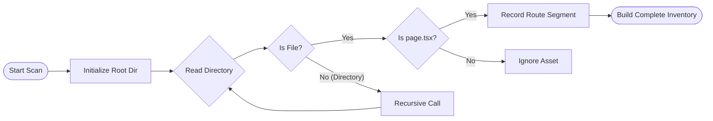
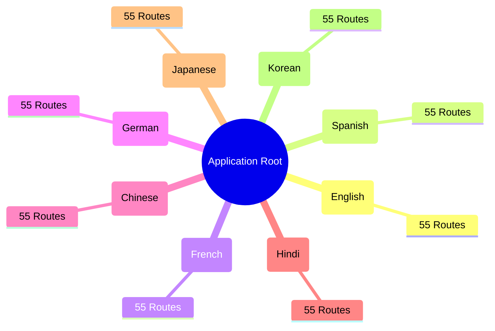
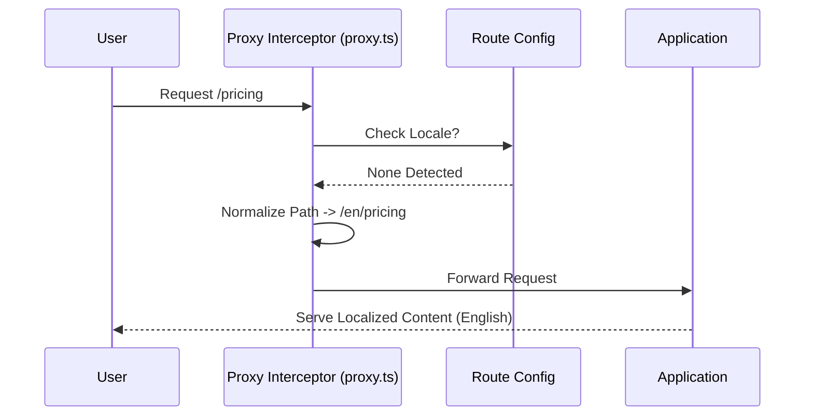

# EXHIBIT B: TECHNICAL ARCHITECTURE & EXHIBITS

**Reference:** These diagrams provide visual evidence of the independent system design authored by the Applicant.

---

## Exhibit B-1: The "Three-Layer Defense" Model
This diagram illustrates the novel architectural separation between Static Analysis, Release Gating, and Runtime Telemetry.

**(Insert Mermaid Diagram from Research Paper Section 4.1 here for PDF conversion)**
> *Caption: The proprietary architecture introducing a deterministic release gate between codebase commits and production deployment.*

---

## Exhibit B-2: Recursive Route Inventory Logic
This flowchart demonstrates the original logic used to dynamically map the application's surface area.

> *Caption: The Applicant's recursive algorithm for traversing the Next.js App Router file system to generate a complete verification matrix.*

---

## Exhibit B-3: Combinatorial Expansion Matrix
Visualizing the scale of the problem solved by the Applicant's system.

> *Caption: The "Combinatorial Explosion" problem. The Applicant's system automatically manages the validation of 440 unique endpoints (8 x 55) generated from a single code base.*

---

## Exhibit B-4: The Proxy Interceptor Logic
Detailing the custom runtime governance layer.

> *Caption: The runtime safety mechanism designed by the Applicant to prevent "bare path" exposure and ensure locale persistence.*
