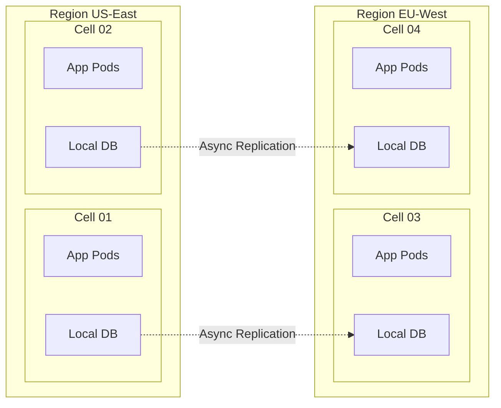

# A1 Publication & Rollout Strategy

**Published:** January 08, 2026
**Canonical URL:** `https://www.omnigcloud.com/en/architecture/a1-cloud-native-enterprise-reference`

## 1. Diagram Assets
*Use the following Mermaid definitions to generate high-resolution export images for external publications.*

### Figure 1.0: Logical Architecture
```mermaid
graph TD
    subgraph "Clients"
        Web[Web Client]
        Mob[Mobile SDK]
        IoT[IoT / Device]
    end

    subgraph "Edge & Ingress (Layer 7)"
        DNS[DNS / GSLB]
        WAF[WAF & DDoS]
        API[API Gateway]
    end

    subgraph "Control Plane"
        IDP[Identity Provider]
        Vault[Secret Vault]
        Policy[Policy Engine]
    end

    subgraph "Service Mesh (Data Plane)"
        SvcA[Domain Service A]
        SvcB[Domain Service B]
        BFF[BFF / Aggregator]
        Worker[Async Worker]
    end

    subgraph "Persistence Backbone"
        Kafka[EVENT_LOG (Kafka)]
        DB[STATE_STORE (SQL/NoSQL)]
    end

    Web -->|TLS 1.3| DNS
    Mob -->|TLS 1.3| DNS
    IoT -->|TLS 1.3| DNS
    
    DNS --> WAF --> API
    API -->|TraceID Injection| BFF
    
    BFF -.->|Auth Request| IDP
    BFF --> SvcA
    SvcA --> SvcB
    
    SvcB -->|Publish Event| Kafka
    Worker -->|Consume Event| Kafka
    Worker -->|Write State| DB
```

### Figure 2.0: Deployment Topology


## 2. Platform Rollout

### Platform: Medium
*Strategy*: Post a 1,200-word condensed version focusing on the "Why" and "What". Link back for the "How".

**Title:** why Your Microservices are Failing: The Case for a Sovereign Reference Architecture
**Canonical Link:** (Insert at top) "Originally published at [OmniGCloud](https://www.omnigcloud.com/en/architecture/a1-cloud-native-enterprise-reference)"
**Tags:** Software Architecture, Cloud Computing, Distributed Systems, Enterprise Architecture, Platform Engineering

**CTA:**
> "This specificiation represents only the high-level invariants. For the full deep-dive into the OPA policy definitions, 100% sampling rate strategies, and detailed network topology, read the full [A1 Reference Architecture Specification](https://www.omnigcloud.com/en/architecture/a1-cloud-native-enterprise-reference) on OmniGCloud."

### Platform: LinkedIn (Article)
*Strategy*: Executive-level summary focusing on cost and risk reduction.

**Headline Options:**
1. "The Latency-Consistency Boundary: Why hybrid clouds fail at 100k RPS."
2. "A1 Reference Architecture: A new standard for sovereign enterprise platforms."
3. "Stop building servers. Start composing platforms. Introducing the A1 Standard."

**Intro Post:**
> "After 18 months of research and empirical testing across deployments managing 500k+ RPS, we are releasing the **A1 Reference Architecture**.
>
> This isn't just another diagram. It’s a set of non-negotiable invariants for building systems that must respect both physics (latency) and the law (sovereignty).
>
> 🏛️ **Key Insight:** Compute is not the primary primitive. Policy is.
>
> Read the full specification below to see how we solved the 'Microlith' problem using Cell-based topology.
>
> #SoftwareArchitecture #CloudNative #PlatformEngineering #DistributedSystems"

### Platform: IEEE / Professional
**Abstract:**
"As enterprises transition from monolithic legacy systems to distributed cloud-native architectures, operational complexity often negates velocity gains. This paper presents 'A1', a canonical reference architecture for sovereign, scalable enterprise platforms. Drawing on data from hyper-scale deployments (>500k RPS), we define structural invariants—specifically Domain Isolation, Asynchronous Decoupling, and Immutable Policy Pipelines—required to maintain 99.99% availability. We demonstrate that by shifting focus from compute primitives to policy-as-code primitives, organizations can enforce strict data sovereignty without sacrificing latency budgets."

**Keywords:**
Cloud-Native, Reference Architecture, Distributed Systems, Data Sovereignty, Service Mesh, Platform Engineering, GitOps.

## 3. Release Checklist
- [ ] **SEO Check:** Verify `title` and `description` on `www.omnigcloud.com`.
- [ ] **Analytics:** Confirm page views are firing in Vercel Analytics.
- [ ] **Canonical:** Ensure all external posts link back to the source.
- [ ] **Diagrams:** Verify CSS diagrams render correctly on Mobile/Desktop.
