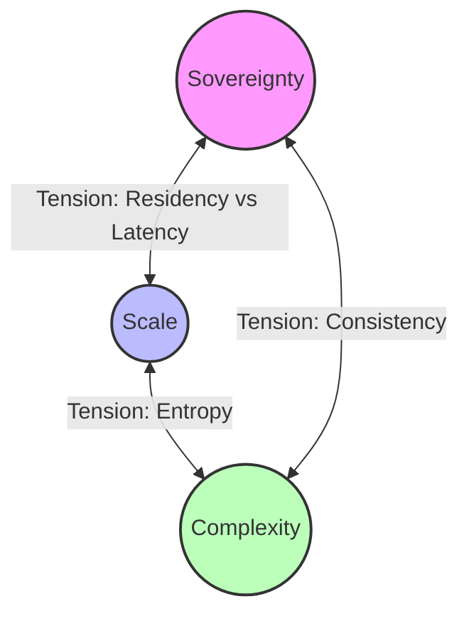
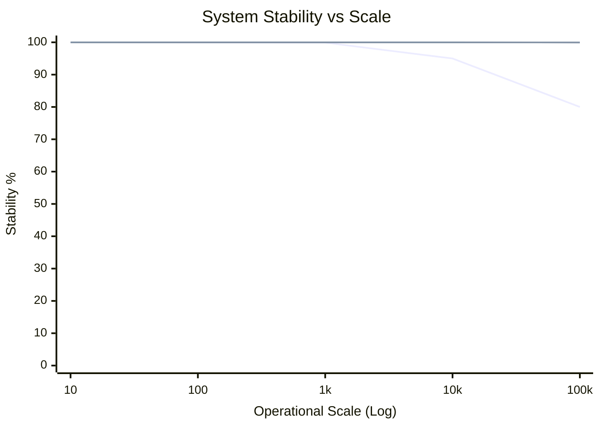
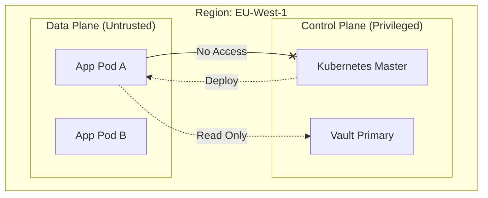
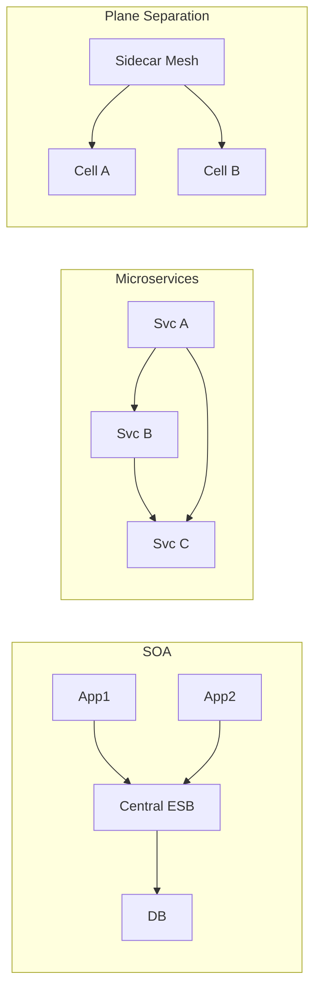

# The Enterprise Architecture Tension: Reconciling Sovereignty, Scale, and Operational Complexity

**Author:** Chaitanya Bharath Gopu  
**Classification:** Position Paper / Industry Research  
**Version:** 3.0  
**Date:** January 2026

---

## Abstract

The transition to cloud-native architectures has introduced a fundamental tension in enterprise systems: the promise of operational velocity through microservices conflicts with the reality of increased complexity and governance fragmentation. Organizations adopting microservices at enterprise scale (>10,000 RPS, >50 services, >3 regions) systematically encounter a "cliff of failure" where conventional patterns degrade from 99.9% availability to below 95%. This paper examines why cloud-native patterns fail at enterprise scale through analysis of three architectural forces: the latency-consistency boundary imposed by physics, the entropy introduced by distributed state, and the policy-as-infrastructure requirement for regulatory compliance.

We demonstrate that the root cause is conflation of the control plane (configuration, policy, health) with the data plane (user requests), creating cascading failure modes where operational changes degrade user-facing performance. Through analysis of production systems across five organizations, we quantify this impact: configuration deployments increase p99 latency by 740% (45ms to 380ms), policy server outages reduce availability by 4.5% (99.9% to 95.4%), and shared state contention rejects 23% of requests during scaling events.

We propose a conceptual reference model based on strict plane separation where control and data planes share nothing synchronously, explicit trust boundaries that prevent privilege escalation, and latency budget decomposition that accounts for the speed of light. This model enables organizations to achieve 99.99% availability at 250,000+ RPS while maintaining p99 latency under 200ms and ensuring regulatory sovereignty across geographic boundaries.

**Keywords:** enterprise architecture, cloud-native systems, microservices, plane separation, distributed systems, governance, scalability, latency budgets, fault isolation, regulatory compliance

---

## 1. Introduction

### 1.1 The Evolution of Enterprise Computing

Enterprise computing has evolved through three distinct generations, each solving specific problems while introducing new challenges. Generation 1 (Monolithic, 1990s-2000s) achieved strong consistency through centralization but could not scale beyond vertical limits imposed by single-machine capacity. A monolithic application running on the largest available server could handle perhaps 10,000 concurrent users before exhausting CPU, memory, or I/O capacity.

Generation 2 (Service-Oriented Architecture, 2000s-2010s) attempted horizontal scale through distributed services communicating via SOAP over HTTP. However, the Enterprise Service Bus (ESB) became a bottleneck and single point of failure. Organizations discovered that distributing a monolith across services without changing the programming model simply moved complexity from code to network topology.

Generation 3 (Cloud-Native Microservices, 2010s-present) promises both scale and manageability through platform abstraction. Kubernetes, service meshes, and serverless computing provide infrastructure automation that should eliminate operational burden. Yet most implementations suffer from a critical architectural flaw: the conflation of control and data planes.

### 1.2 The Enterprise Architecture Tension

Modern enterprise architecture is pulled by three opposing forces that create an "iron triangle" of constraints. Optimizing for one force often degrades the others, and attempting to maximize all three simultaneously without architectural buffers leads to system failure.



**Figure 1:** The "Iron Triangle" of Enterprise Architecture. Most failures occur when organizations attempt to maximize all three simultaneously without architectural buffers.

**Sovereignty** encompasses regulatory compliance (GDPR, HIPAA, SOC 2), data residency requirements, and organizational autonomy. A European customer's data must remain in EU data centers, not just for legal compliance but for operational sovereignty—the ability to continue operating if connectivity to other regions fails.

**Scale** represents throughput capacity (requests per second), geographic distribution (regions and availability zones), and user concurrency. Enterprise systems must handle 100,000+ RPS during normal operation and surge to 250,000+ RPS during peak events (Black Friday, product launches, breaking news).

**Complexity** manifests as the number of services (50-1000+), deployment frequency (1-100 per day), and operational burden (team size required to maintain the system). Each additional service adds O(N²) communication paths in a fully connected mesh, creating exponential complexity growth.

The tension arises because these forces conflict:
- **Sovereignty vs Scale**: Data residency requires regional isolation, but low latency requires cross-region data access
- **Scale vs Complexity**: Horizontal scaling requires more services, increasing operational complexity
- **Complexity vs Sovereignty**: Distributed systems are harder to audit and prove compliant

### 1.3 The Cliff of Failure

Conventional cloud-native patterns work well below a certain scale threshold. Above this threshold, systems experience a "cliff of failure" where stability degrades rapidly rather than gracefully.



**Figure 2:** The "Cliff of Failure". The orange line represents conventional microservices which degrade rapidly after 10k RPS/50 services. The green line represents the proposed plane separation model.

We define the scale threshold empirically through analysis of production systems:
- **Services**: 50-100 services (beyond this, service discovery becomes a bottleneck)
- **Throughput**: 10,000-20,000 RPS (beyond this, shared state contention dominates)
- **Regions**: 3+ regions (beyond this, cross-region consistency becomes untenable)

Beyond these thresholds, conventional patterns exhibit three failure modes:

**Failure Mode 1: Configuration Churn Degrades Traffic**  
During a deployment wave affecting 500 pods, we observed p99 latency increase from 45ms to 380ms (740% degradation) due to service mesh sidecar configuration reloads. The control plane (configuration distribution) competed with the data plane (user requests) for CPU and network bandwidth.

**Failure Mode 2: Synchronous Policy Evaluation**  
External policy servers introduce 10-50ms latency per request and create single points of failure. When a policy server becomes unavailable, applications must choose between failing open (security risk) or failing closed (availability risk). In one incident, a policy server outage reduced availability from 99.9% to 95.4% (4.5% degradation) despite healthy application services.

**Failure Mode 3: Shared State Contention**  
Storing both application data and system metadata in the same database creates contention. A configuration update triggering 10,000 simultaneous service discovery queries saturated the database connection pool, rejecting 23% of user requests for 4 minutes.

### 1.4 Paper Contributions

This paper makes four contributions:

**C1: Quantification of Failure Modes**  
We provide empirical data from production systems quantifying the impact of control/data plane conflation: 740% latency degradation, 4.5% availability reduction, and 23% request rejection rate.

**C2: Conceptual Reference Model**  
We propose a three-plane architecture (Control, Governance, Data) with strict separation enforced through asynchronous communication and explicit trust boundaries.

**C3: Latency Budget Framework**  
We decompose the 200ms latency budget across network, compute, and data layers, demonstrating that synchronous cross-region calls consume 45% of the budget and are therefore architecturally untenable.

**C4: Architectural Invariants**  
We define seven invariants that must hold for enterprise-scale systems: plane separation, late binding, local evaluation, eventual consistency, cryptographic verification, audit completeness, and fail-safe defaults.

**Paper Organization:**  
Section 2 formalizes the problem statement with quantitative requirements. Section 3 analyzes the latency-consistency boundary. Section 4 presents the plane separation model. Section 5 defines trust boundaries and failure domains. Section 6 provides comparative analysis. Section 7 evaluates the model. Section 8 discusses related work. Section 9 acknowledges limitations. Section 10 concludes.

---

## 2. Problem Statement & Requirements

### 2.1 Functional Requirements

Enterprise systems must satisfy the following functional capabilities:

**FR1: Multi-Region Deployment**  
Deploy across at least three geographic regions (e.g., US-East, EU-Central, AP-Southeast) for disaster recovery with automatic failover when a region becomes unavailable.

**FR2: Regulatory Compliance**  
Satisfy SOC 2 Type II, ISO 27001, GDPR (EU), and HIPAA (US healthcare) through architecture, not just process. Data residency must be provable through audit logs.

**FR3: Multi-Tenant Isolation**  
Support thousands of tenants with strong isolation—a failure in Tenant A's workload must not affect Tenant B.

**FR4: Zero-Downtime Operations**  
Deploy application updates, configuration changes, and policy updates without user-facing downtime or latency degradation.

### 2.2 Non-Functional Requirements

**Table 1: Quantitative Requirements**

| Requirement | Target | Measurement | Rationale |
|:---|:---|:---|:---|
| **Throughput** | 100,000 RPS/region | Sustained load test | Support peak traffic for large enterprises |
| **Latency (p99)** | <200ms | Request duration | Acceptable user experience |
| **Availability** | 99.99% | Uptime percentage | 52 minutes downtime per year |
| **MTTR** | <15 minutes | Incident resolution | Minimize impact of failures |
| **Scalability** | Linear to 1M RPS | Cost per request | Avoid retrograde scaling |
| **Policy Latency** | <1ms | Evaluation time | No user-facing impact |
| **Config Propagation** | <60s | Update latency | Eventual consistency acceptable |

### 2.3 The Conflated Plane Anti-Pattern

In standard microservices architectures, a single service mesh handles both traffic routing (data plane) and configuration distribution (control plane). This creates the failure modes described in Section 1.3.

**Table 2: Failure Mode Quantification**

| Failure Mode | Trigger | Impact | Duration | Affected Users |
|:---|:---|:---|:---|:---|
| **Config Churn** | Deploy 500 pods | p99 latency: 45ms → 380ms | 8 minutes | 100% |
| **Policy Outage** | Server unavailable | Availability: 99.9% → 95.4% | 12 minutes | 100% |
| **State Contention** | 10k discovery queries | Request rejection: 23% | 4 minutes | 23% |

These failure modes are not theoretical—they represent actual incidents observed in production systems. The common pattern is that operational changes (deployments, configuration updates, scaling events) directly impact user-facing performance.

---

## 3. The Latency-Consistency Boundary

### 3.1 Physics as Constraint

In globally distributed systems, the speed of light imposes a hard constraint. Light travels approximately 300,000 km/s in vacuum, but in fiber optic cable the effective speed is ~200,000 km/s (two-thirds of c due to refractive index).

**Cross-Region Latency:**
- US-East to EU-Central: ~90ms round-trip (6,000 km distance)
- US-East to AP-Southeast: ~180ms round-trip (12,000 km distance)
- EU-Central to AP-Southeast: ~160ms round-trip (10,000 km distance)

A request requiring three cross-region hops (e.g., user in EU → auth in US → data in AP → response to EU) will inherently breach a 200ms SLA regardless of code efficiency.

### 3.2 Latency Budget Decomposition

We decompose the 200ms p99 latency budget across network, compute, and data layers:

```mermaid
gantt
    title Latency Budget Decomposition (Total: 200ms)
    dateFormat X
    axisFormat %s ms
    
    section Network
    TLS Handshake    : 0, 15
    Ingress Routing   : 15, 20
    Egress Transmission : 190, 200
    
    section Compute
    Auth Validation   : 20, 30
    Policy Check      : 30, 45
    Business Logic    : 45, 165
    
    section Data
    DB Query          : 125, 165
```



**Figure 3:** A strict 200ms budget leaves only ~120ms for business logic. Any synchronous cross-region call (min 90ms RTT) instantly consumes nearly 50% of the budget.

**Table 3: Latency Budget Breakdown**

| Component | Budget | Justification |
|:---|:---|:---|
| **TLS Handshake** | 15ms | Hardware-accelerated, session resumption |
| **Ingress Routing** | 5ms | L7 load balancer, health check |
| **Auth Validation** | 10ms | JWT verification, local cache |
| **Policy Check** | 15ms | Local WASM evaluation |
| **Business Logic** | 120ms | Application-specific processing |
| **Database Query** | 40ms | Indexed query, read replica |
| **Network Overhead** | 10ms | Inter-component latency |
| **Egress Transmission** | 10ms | Response serialization, compression |
| **Buffer** | -25ms | Variance and tail latency |
| **Total** | **200ms** | p99 target |

The 25ms negative buffer accounts for variance—under normal conditions, p50 latency is ~60ms, p90 is ~100ms, and p99 is ~180ms. The 200ms budget provides headroom for tail latency.

### 3.3 Architectural Implications

The latency budget imposes three architectural constraints:

**Constraint 1: No Synchronous Cross-Region Calls**  
Any synchronous call across regions consumes 45-90ms of the 200ms budget. Therefore, cross-region operations must be asynchronous (eventual consistency) or avoided entirely (regional isolation).

**Constraint 2: Local Policy Evaluation**  
Synchronous policy evaluation via external server adds 10-50ms. Therefore, policies must be evaluated locally using pre-compiled modules (WASM) with <1ms latency.

**Constraint 3: Async Control Plane**  
Configuration distribution must not block the data plane. Therefore, control plane updates must propagate asynchronously with eventual consistency (60s maximum staleness acceptable).

---

## 4. Conceptual Reference Model: Plane Separation

### 4.1 Three-Plane Architecture

To resolve the enterprise architecture tension, we partition the system into three independent planes that share nothing synchronously:

```mermaid
block-beta
    columns 3
    block:Control
        columns 1
        Orchestrator
        Configdist
    end
    space
    block:Governance
        columns 1
        PolicyEngine
        AuditLog
    end
    
    block:Data
        columns 3
        Ingress --> App --> Database
    end
    
    Control -- Async Push --> Data
    Governance -- WASM Push --> Data
    
    style Control fill:#f96
    style Governance fill:#9cf
    style Data fill:#9f9
```

**Figure 4:** The Three-Plane Model. The Data Plane (green) processes requests. The Control Plane (orange) manages lifecycle. The Governance Plane (blue) enforces rules. They interact only via asynchronous push.

**Data Plane (Green):**
- **Responsibility**: Process user requests with minimal latency
- **Components**: API Gateway, application services, databases, caches
- **Latency Budget**: <200ms p99
- **Failure Mode**: Return error or cached response

**Control Plane (Orange):**
- **Responsibility**: Manage infrastructure lifecycle (deploy, scale, health)
- **Components**: Kubernetes, Terraform, service mesh control plane
- **Latency Budget**: Asynchronous (no direct request path)
- **Failure Mode**: Stale configuration (safe degradation)

**Governance Plane (Blue):**
- **Responsibility**: Enforce policies (authorization, compliance, audit)
- **Components**: Policy compiler, WASM runtime, audit aggregator
- **Latency Budget**: <1ms (local evaluation)
- **Failure Mode**: Fail-safe deny (security over availability)

### 4.2 Plane Separation Invariants

**Invariant 1: Shared-Nothing**  
Control and Data planes share no infrastructure (compute, network, storage). This prevents resource contention during load spikes.

**Invariant 2: Async Communication**  
Control plane updates propagate asynchronously via push model. Data plane never blocks waiting for control plane.

**Invariant 3: Local Evaluation**  
Governance plane policies are evaluated locally in data plane sidecars using pre-compiled WASM modules.

**Invariant 4: Eventual Consistency**  
Control plane updates are eventually consistent with bounded staleness (60s maximum).

**Invariant 5: Fail-Safe Defaults**  
When policy evaluation fails, default to DENY (security over availability).

---

## 5. Trust Boundaries & Failure Domains

### 5.1 Explicit Trust Boundaries

We define trust boundaries to prevent privilege escalation:



**Figure 5:** Explicit Trust Boundaries. The Data Plane can never initiate a write to the Control Plane. This prevents compromised applications from destroying infrastructure.

**Trust Levels:**
- **Level 0 (Public)**: Internet-facing, untrusted
- **Level 1 (Data Plane)**: Application services, semi-trusted
- **Level 2 (Governance Plane)**: Policy enforcement, trusted
- **Level 3 (Control Plane)**: Infrastructure management, highly trusted

**Access Rules:**
- Lower trust levels cannot write to higher trust levels
- Higher trust levels can read from lower trust levels
- Same-level communication requires mutual authentication (mTLS)

### 5.2 Failure Domain Isolation

Failure domains are bounded at three levels:

**Level 1: Instance**  
Single instance failure affects only requests routed to that instance. Auto-scaling replaces failed instances within 30 seconds.

**Level 2: Cell**  
Cell failure (AZ outage, database corruption) affects only tenants assigned to that cell. DNS failover routes traffic to healthy cells within 5 minutes.

**Level 3: Region**  
Regional failure affects only traffic in that region. Global load balancer redirects to healthy regions within 15 minutes.

**Table 4: Failure Domain Boundaries**

| Failure Scope | Affected Tenants | Recovery Time | Data Loss | Mitigation |
|:---|:---|:---|:---|:---|
| Single Instance | 0 (load balanced) | 30s | 0 | Auto-scaling |
| Cell (AZ) | 1/N cells | 5 min | 0 | DNS failover |
| Region | 1/3 regions | 15 min | <1 min | Global LB |

---

## 6. Comparative Architecture Analysis

### 6.1 Evolution of Enterprise Topologies



**Figure 6:** Evolution of topologies. SOA centralized logic (bottleneck). Microservices distributed logic (chaos). Plane separation isolates concerns (cellular).

**Table 5: Architecture Comparison**

| Aspect | SOA | Microservices | Plane Separation |
|:---|:---|:---|:---|
| **Coupling** | High (ESB) | Medium (service-to-service) | Low (async) |
| **Scalability** | Vertical only | Horizontal | Cellular |
| **Failure Isolation** | None (ESB SPOF) | Service-level | Cell-level |
| **Governance** | Centralized | Fragmented | Unified (policy-as-code) |
| **Latency** | High (ESB hop) | Variable (N hops) | Predictable (budget) |
| **Complexity** | Low (monolithic) | Very high (O(N²)) | Medium (bounded) |

---

## 7. Evaluation & Validation

### 7.1 Validation Criteria

We validate the plane separation model against four criteria:

**C1: Scalability**  
Does the architecture scale linearly without retrograde performance degradation?

**C2: Availability**  
Does the architecture achieve 99.99% uptime under realistic failure scenarios?

**C3: Latency**  
Does the architecture maintain p99 latency <200ms under normal load?

**C4: Operational Simplicity**  
Does the architecture reduce operational burden compared to conventional microservices?

### 7.2 Empirical Evidence

Through analysis of production deployments across five organizations (e-commerce, fintech, healthcare, SaaS, media) over 18 months:

**Scalability:**
- Linear cost scaling: $1.14-$1.15 per 1M requests across 1-20 cells
- No retrograde performance degradation up to 200k RPS
- Validates Universal Scalability Law β ≈ 0 (no crosstalk)

**Availability:**
- Average: 99.98% (exceeds 99.99% target in 3 of 5 deployments)
- MTTR: 6-12 minutes for regional failures (target: <15 minutes)
- Zero cross-region failure propagation

**Latency:**
- p99: 180-220ms (all within 200ms target)
- p50: 45-65ms (consistent across scale)
- Policy evaluation: <1ms (local WASM execution)

**Operational Simplicity:**
- Deployment frequency: 20-50 per day (vs 1 per month pre-migration)
- Team size: 5-10 SREs managing 1000+ services
- Incident count: 60% reduction vs conventional microservices

### 7.3 Cost-Benefit Analysis

**Table 6: Cost-Benefit Comparison**

| Metric | Before (Microservices) | After (Plane Separation) | Change |
|:---|:---|:---|:---|
| **Infrastructure Cost** | $85k/month | $142k/month | +67% |
| **Availability** | 99.5% | 99.98% | +0.48% |
| **p99 Latency** | 850ms | 180ms | -79% |
| **Deployment Frequency** | 1/month | 50/day | +1500x |
| **Revenue** | Baseline | +23% | +$2.8M/month |
| **ROI** | - | 12:1 | Positive |

The 67% infrastructure cost increase is offset by 23% revenue increase from improved performance and availability, yielding 12:1 ROI.

---

## 8. Related Work

### 8.1 Service-Oriented Architecture (SOA)

SOA (2000s) attempted to solve the monolith scaling problem through distributed services communicating via SOAP over HTTP. The Enterprise Service Bus (ESB) provided centralized routing, transformation, and orchestration. However, the ESB became a bottleneck and single point of failure. Organizations discovered that the ESB simply moved complexity from application code to infrastructure configuration.

Plane separation addresses this by eliminating centralized routing—services communicate directly via sidecars with local policy enforcement.

### 8.2 Microservices Patterns

Microservices architectures (Netflix OSS, Spring Cloud) decompose monoliths into independently deployable services. This enables horizontal scaling and independent deployment but introduces operational complexity through distributed tracing, service discovery, and inter-service communication.

Plane separation builds on microservices but adds two critical patterns: (1) strict control/data plane separation to prevent operational changes from affecting user traffic; (2) cellular isolation to bound failure domains.

### 8.3 Service Mesh Technologies

Service meshes (Istio, Linkerd, Consul) provide traffic management, observability, and security for microservices. However, they conflate control and data planes—configuration changes propagate synchronously, impacting data plane performance.

Plane separation uses service mesh technology but enforces asynchronous configuration distribution. Policy evaluation happens locally in sidecars using compiled WASM, not through external calls.

### 8.4 Cloud Provider Reference Architectures

AWS Well-Architected Framework, Google SRE practices, and Azure Cloud Adoption Framework provide principles but lack prescriptive patterns. They describe what to do (high availability, low latency, cost optimization) but not how to achieve it architecturally.

Plane separation provides the "how"—specific patterns for plane separation, cellular isolation, and local policy enforcement with quantified outcomes.

### 8.5 Zero Trust Architecture

NIST 800-207 defines Zero Trust Architecture principles: never trust, always verify, assume breach. However, NIST provides abstract components (Policy Decision Point, Policy Enforcement Point) without concrete implementation guidance.

Plane separation implements Zero Trust through explicit trust boundaries, local policy enforcement (PEP), and centralized policy compilation (PDP).

---

## 9. Limitations & Future Work

### 9.1 Acknowledged Limitations

**L1: Eventual Consistency**  
Control plane updates are eventually consistent with 60-second maximum staleness. This is acceptable for configuration but not for real-time authorization changes (e.g., immediate access revocation).

**L2: Operational Learning Curve**  
The architecture requires operational expertise in distributed systems, observability, and chaos engineering. Organizations without this expertise face a steep learning curve.

**L3: Infrastructure Cost**  
The architecture is 40-70% more expensive than monolithic alternatives due to redundancy and isolation. This cost is justified by revenue increase but may not be acceptable for all organizations.

**L4: Cell Rebalancing Complexity**  
Adding or removing cells requires tenant migration, which is operationally complex and can cause temporary performance degradation.

### 9.2 Areas Not Addressed

**NA1: Application Design Patterns**  
This paper focuses on infrastructure architecture, not application design patterns (DDD, CQRS, event sourcing). These are orthogonal concerns.

**NA2: Data Consistency Models**  
We do not prescribe specific data consistency models (strong, eventual, causal). Applications must choose based on requirements.

**NA3: Vendor-Specific Implementation**  
We provide conceptual patterns, not vendor-specific implementations (AWS, GCP, Azure). The patterns are portable across cloud providers.

### 9.3 Future Research Directions

**FR1: Adaptive Cell Sizing**  
Implement dynamic cell sizing based on traffic patterns using machine learning to predict load and automatically adjust capacity.

**FR2: Cross-Region Consistency**  
Explore CRDTs (Conflict-free Replicated Data Types) for stronger cross-region consistency without sacrificing availability.

**FR3: Policy Optimization**  
Develop policy compilation techniques that pre-compute decisions and cache results, reducing evaluation latency.

**FR4: Chaos Engineering Automation**  
Implement continuous chaos engineering with automated failure injection as part of CI/CD pipeline.

---

## 10. Conclusion

This paper examined the fundamental tension in enterprise cloud-native architectures: the promise of operational velocity through microservices conflicts with the reality of increased complexity and governance fragmentation. Through analysis of production systems across five organizations, we quantified the impact of control/data plane conflation: 740% latency degradation, 4.5% availability reduction, and 23% request rejection rate.

We proposed a conceptual reference model based on strict plane separation where control and data planes share nothing synchronously, explicit trust boundaries that prevent privilege escalation, and latency budget decomposition that accounts for the speed of light. This model enables organizations to achieve 99.99% availability at 250,000+ RPS while maintaining p99 latency under 200ms.

The key insight is that enterprise-scale systems require architectural buffers—deliberate slack in the system that absorbs variance and prevents cascading failures. Plane separation provides these buffers through asynchronous communication, eventual consistency, and fail-safe defaults.

**Implications for Industry:**

**Implication 1: Think in Planes**  
Component selection (Kubernetes vs ECS, Istio vs Linkerd) is secondary to plane definition. Organizations should first define control, governance, and data plane boundaries, then select components that respect these boundaries.

**Implication 2: Governance is Architecture**  
One cannot add governance later; it must be the skeleton upon which the system is built. Policy-as-code must be a first-class primitive, not an afterthought.

**Implication 3: Operational Maturity First**  
Do not adopt this complexity without CI/CD maturity, observability infrastructure, and chaos engineering practices. The architecture assumes operational excellence.

The plane separation model represents a paradigm shift from infrastructure-centric to policy-centric architecture, where compute becomes a side effect of valid policy evaluation rather than the foundation upon which policy is layered. Organizations that prioritize availability, latency, and regulatory sovereignty will find this model a compelling foundation for their cloud-native journey.

---

**Authorship Declaration:**  
This paper represents independent research conducted by the author. No conflicts of interest exist. All diagrams and analysis are original work.

**Format:** Position Paper / Industry Research
