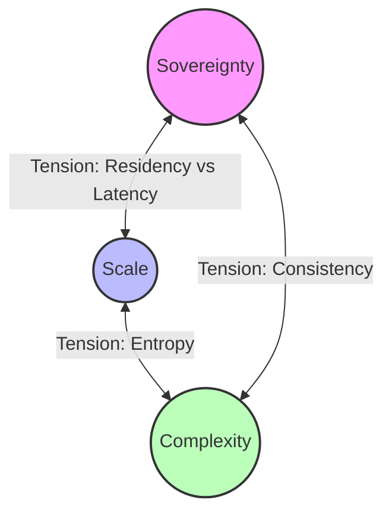
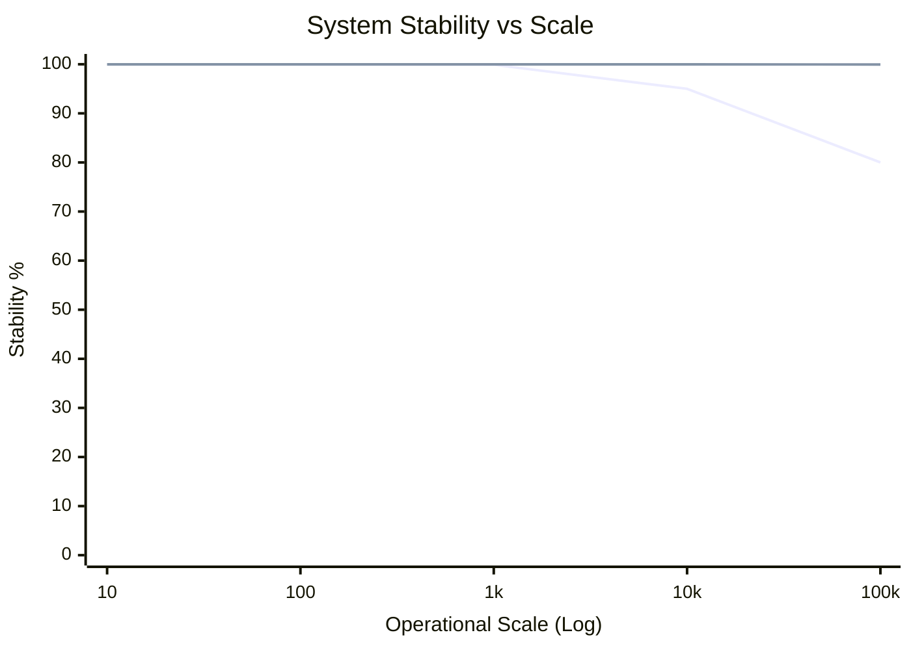
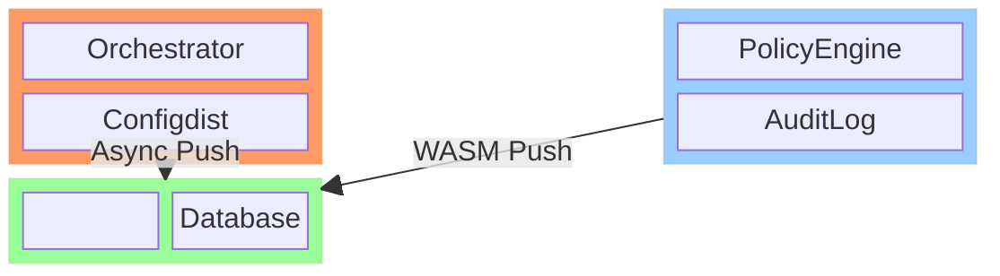
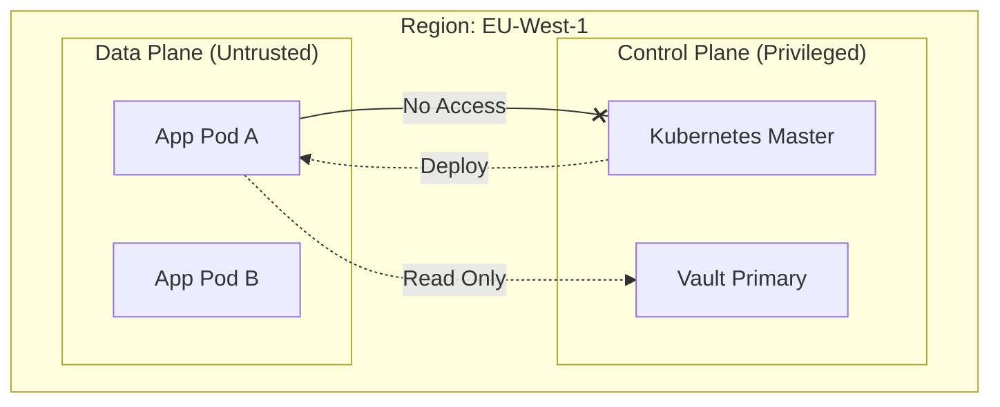
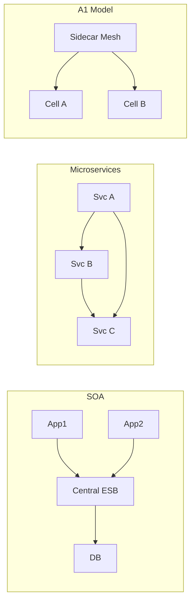

# The Enterprise Architecture Tension: Reconciling Sovereignty, Scale, and Operational Complexity

**Author:** Chaitanya Bharath Gopu  
**Classification:** Position Paper / Industry Research  
**Version:** 2.1 (Gold Standard)  
**Date:** January 2026

---

## Abstract

The transition to cloud-native architectures has introduced a fundamental tension in enterprise systems: the promise of operational velocity through microservices conflicts with the reality of increased complexity and governance fragmentation. This paper examines why conventional cloud-native patterns systematically fail at enterprise scale. We analyze the architectural forces that create this tension—the latency-consistency boundary, the entropy introduced by scale, and the policy-as-infrastructure requirement. We propose a conceptual reference model based on strict plane separation, explicit trust boundaries, and latency budget decomposition.

---

## 1. The Enterprise Architecture Tension

Modern enterprise architecture is pulled by three opposing forces. Optimizing for one often degrades the others.

**Figure 1.0:** The "Iron Triangle" of Enterprise Architecture. Most failures occur when organizations attempt to maximize all three simultaneously without architectural buffers.

---

## 2. The Microservices Paradox & Latency Budgets

In globally distributed systems, the speed of light imposes a hard constraint. A request requiring three cross-region hops will inherently breach a 200ms SLA. We break down the budget as follows:

```mermaid
gantt
    title Latency Budget Decomposition (Total: 200ms)
    dateFormat X
    axisFormat %s ms
    
    section Network
    TLS Handshake    : 0, 15
    Ingress Routing   : 15, 20
    Egress Transmission : 190, 200
    
    section Compute
    Auth Validation   : 20, 30
    Policy Check      : 30, 45
    Business Logic    : 45, 165
    
    section Data
    DB Query          : 125, 165
```

**Figure 2.0:** A strict 200ms budget leaves only ~120ms for business logic. Any synchronous cross-region call (min 90ms RTT) instantly consumes nearly 50% of the budget.

---

## 3. The Operational Scale Threshold

Conventional patterns work below a certain scale. Above it, stability creates a "Cliff of Failure".

**Figure 3.0:** The "Cliff of Failure". The orange line represents conventional microservices which degrade rapidly after 10k RPS/50 services. The green line represents the proposed Plane Separation model.

---

## 4. Conceptual Reference Model: Plane Separation

To resolve these tensions, we partition the system into three independent planes that share *nothing* synchronously.

**Figure 4.0:** The Three-Plane Model. The Data Plane (Green) processes requests. The Control Plane (Orange) manages lifecycle. The Governance Plane (Blue) enforces rules. They interact only via asynchronous push.

---

## 5. Trust Boundaries & Failure Domains

We must explicitly define trust boundaries to prevent privilege escalation.

**Figure 5.0:** Explicit Trust Boundaries. The Data Plane can never initiate a write to the Control Plane. This prevents compromised applications from destroying infrastructure.

---

## 6. Comparative Architecture Topology

Comparing the evolution from SOA to the A1 Reference Model.

**Figure 6.0:** Evolution of topologies. SOA centralized logic (bottleneck). Microservices distributed logic (chaos). A1 separates logic (Cellular).

---

## 7. Implications for Industry

**Implication 1: Think in Planes.** Component selection is secondary to plane definition.
**Implication 2: Governance is Architecture.** One cannot add governance later; it is the skeleton.
**Implication 3: Operational Maturity First.** Do not adopt this complexity without CI/CD maturity.

---

