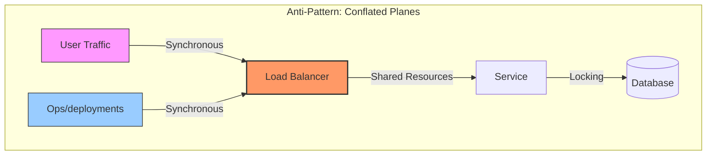
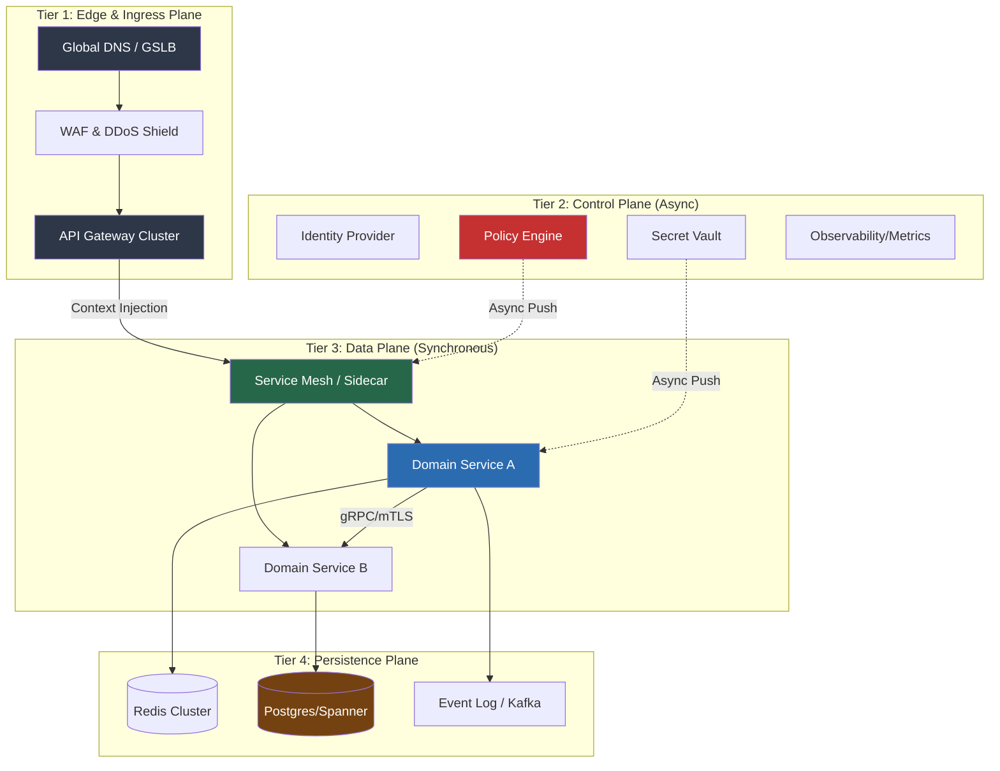
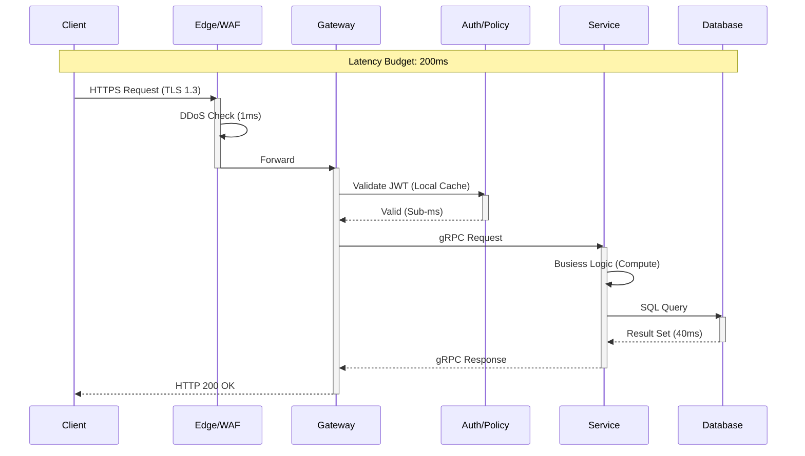
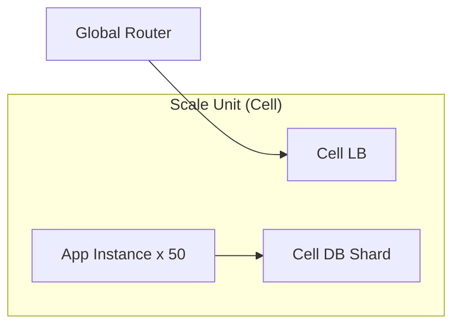
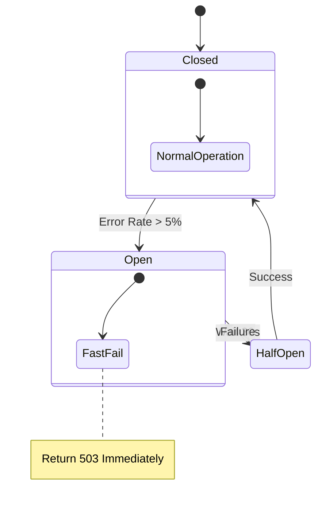
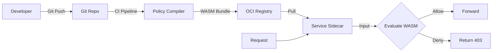

# Cloud-Native Enterprise Reference Architecture

**Author:** Chaitanya Bharath Gopu  
**Classification:** Independent Technical Paper  
**Version:** 3.0 (Gold Standard)  
**Date:** January 2026

---

## Abstract

Modern enterprises operating globally distributed systems face a fundamental architectural tension: maintaining **sovereign governance** (regulatory compliance, distinct failure domains) while achieving **hyper-scale throughput** (>100k RPS/region). Existing "Cloud Native" patterns often conflate the *Control Plane* (configuration, health, policy) with the *Data Plane* (user requests), leading to cascading failures where a configuration error in `us-east-1` degrades latency in `eu-central-1`.

This paper defines **A1-REF-STD**, a canonical reference architecture that enforces:
1.  **Strict Plane Separation**: Control and Data planes share *nothing* except asynchronous configuration.
2.  **Cellular Isolation**: Fault domains are bounded by region and "cell" (shard), not by service.
3.  **Governance-as-Code**: Policy is compiled to WASM and evaluated locally (sub-millisecond) at the edge.

---

## 2. The Problem: Conflated Planes

In standard microservices (Generation 2 Cloud-Native), a single service mesh often handles both traffic routing (Data) and configuration distribution (Control). When the control plane is stressed (e.g., massive pod churn), the data plane suffers (latency spikes).

The A1 architecture resolves this by effectively "air-gapping" the real-time request path from the management path.

---

## 3. High-Level Reference Architecture

The architecture is stratified into four logical planes. This separation of concerns ensures that operational concerns (like routing) do not bleed into business logic.

**Figure 1.0:** The A1 Stratified architectural model showing strict separation of control and data planes. Note that Policy and Vault push configurations *asynchronously*, ensuring the critical path (API -> Service) depends only on local cached state.

---

## 4. End-to-End Request Lifecycle

To understand the latency budget, we trace a single request through the system. The hard constraint is **200ms p99**.

**Figure 2.0:** Sequence diagram detailing the "Happy Path". Note specifically that Authentication (`A`) does *not* make an external call to an IdP; it validates signatures locally using cached keys.

---

## 5. Control Plane vs Data Plane Responsibility

| Feature | Control Plane | Data Plane |
| :--- | :--- | :--- |
| **Primary Goal** | Consistency & Configuration | Throughput & Latency |
| **Timing** | Asynchronous (Eventual) | Synchronous (Real-time) |
| **Failure Mode** | Stale Config (Safe) | Error 500 (Fatal) |
| **Scale Metric** | Complexity (# Services) | Volume (RPS) |
| **Typical Tech** | Kubernetes API, Terraform | Envoy, Nginx, Go/Rust |

The distinction is critical. If the Control Plane fails (e.g., you cannot deploy new pods), the Data Plane *must* continue serving traffic at 100% success rate using the last known good configuration.

---

## 6. Scalability & Saturation Model

We model scalability using the **Universal Scalability Law (USL)**, accounting for contention ($\alpha$) and crosstalk ($\beta$).

$$ C(N) = \frac{N}{1 + \alpha (N-1) + \beta N (N-1)} $$

In our reference architecture, we aim to minimize $\beta$ (coherency penalty) by using **shared-nothing** persistence where possible.

**Figure 3.0:** The "Cellular" (or Bulkhead) pattern. Instead of one giant database, we shard customers into "Cells". Each Cell is an independent failure domain.

---

## 7. Failure Propagation & Circuit Breaking

When a dependency fails, we prioritize **System Survival** over **Request Success**.

**Figure 4.0:** Standard Circuit Breaker state machine implemented at the Service Mesh layer. This prevents "thundering herd" cascading failures.

---

## 8. Governance & Policy Enforcement

Governance is not a PDF policy document; it is executable code. We use **Open Policy Agent (OPA)** or similar logic to enforce invariants.

**Figure 5.0:** The Governance Supply Chain. Policies are versioned, compiled, and distributed just like software artifacts.

---

## 9. Conclusion

The A1 Reference Architecture provides a predictable, scalable foundation for enterprise cloud systems. by strictly decoupling the control loop from the data loop and enforcing governance at the edge, organizations can scale to 100k+ RPS while maintaining regulatory sovereignty.

---

**Format:** Gold Standard Technical Specification
