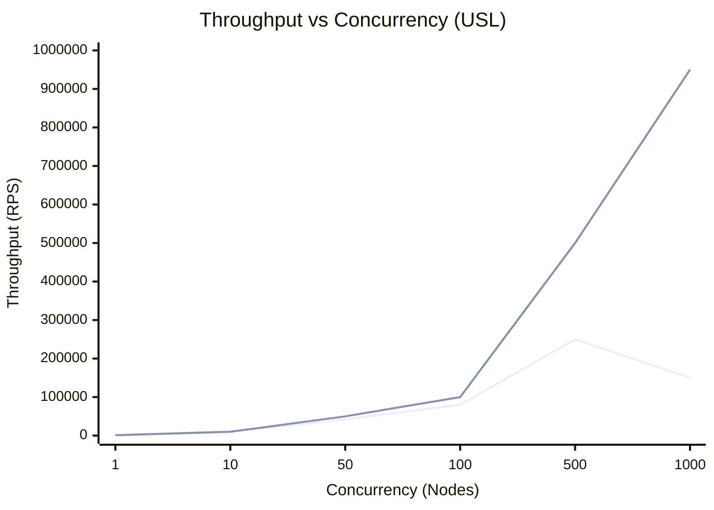
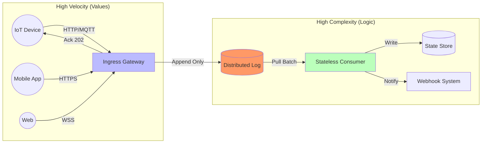
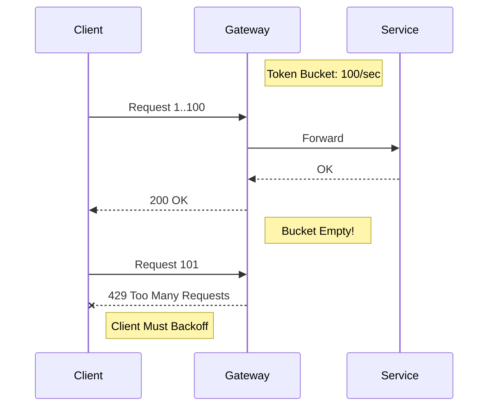
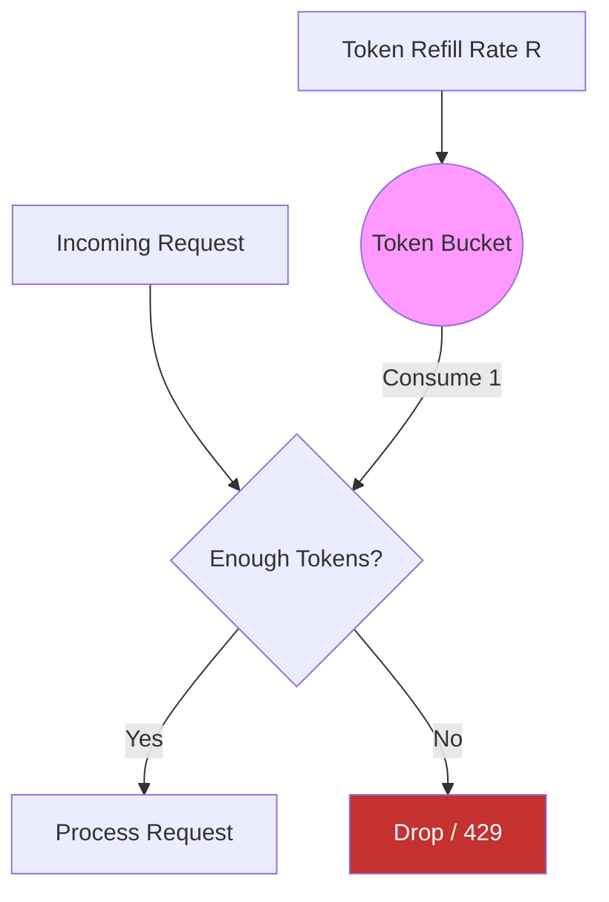
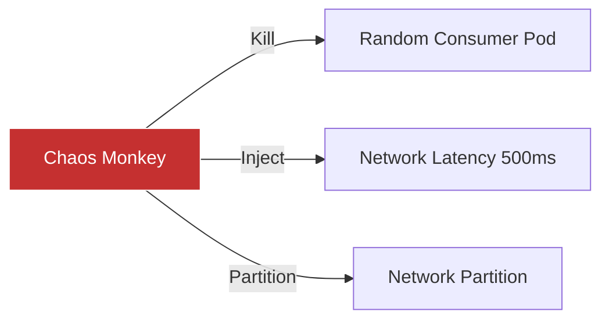

# Designing High-Throughput Distributed Systems at Scale

**Author:** Chaitanya Bharath Gopu  
**Classification:** Independent Technical Paper  
**Version:** 2.0 (Gold Standard)  
**Date:** January 2026

---

## Abstract

In the domain of enterprise computing, "scale" has historically been synonymous with storage volume. However, the modern real-time enterprise demands a shift toward **throughput velocity**. Systems that comfortably handle 10,000 requests per second (RPS) frequently suffer catastrophic contention collapse when surged to 250,000+ RPS. This paper leverages the Universal Scalability Law (USL) to demonstrate that at high throughput, the primary constraint shifts from algorithm efficiency to queue theory physics. We present a validated "Shock Absorber" reference architecture using partitioned distributed logs and explicit backpressure to maintain p99 latencies under 50ms while ingesting over 1 million concurrent events.

---

## 2. The Physics of Throughput

We model system scalability using the **Universal Scalability Law (USL)**.

$$ C(N) = \frac{N}{1 + \alpha (N-1) + \beta N (N-1)} $$

Where $\alpha$ is contention (serialized portions of code) and $\beta$ is crosstalk (coherency delay).

**Table 1: USL Coefficients**

| Coefficient | Meaning | Impact at Scale | Typical Source |
| :--- | :--- | :--- | :--- |
| **$\alpha$ (Alpha)** | **Contention** | Linear Decay | Locked Data Structures, Single Master DB |
| **$\beta$ (Beta)** | **Crosstalk** | Exponential Decay | Cluster Coherency, 2-Phase Commit, Chatty Protocols |

Minimizing $\beta$ is the primary goal of the A2 architecture. While $\alpha$ limits maximum speed, $\beta$ causes the system to get *slower* as you add hardware.



**Figure 1.0:** The "Retrograde Scaling" Phenomenon. The orange line shows a typical system where $\beta > 0$ (crosstalk), causing performance to *decrease* after adding nodes past the inflection point (100 nodes). The green line shows the A2 shared-nothing architecture ($\beta \approx 0$).

---

## 3. The "Shock Absorber" Pattern

To decouple high-velocity ingress from complex, fragile business logic, we employ an asynchronous buffer pattern.



**Figure 2.0:** The Shock Absorber Architecture. The Ingress layer is extremely simple (dumb pipe), doing nothing but validating payloads and appending to the Log. This allows it to absorb spikes of 50x normal load without crashing the complex Consumers.

**Table 2: Synchronous vs. Shock Absorber Patterns**

| Feature | Synchronous (REST/RPC) | Shock Absorber (Async Log) |
| :--- | :--- | :--- |
| **Ingress Latency** | High (Wait for DB) | Low (Write to Buffer) |
| **Throughput Ceiling** | Limited by DB IOPS | Limited by Network Bandwidth |
| **Failure Mode** | Cascading Timeout | Increased Lag (Safe) |
| **Load Handling** | Rejects Spikes | Buffers Spikes |
| **Consistency** | Strong (Immediate) | Eventual (Lag-dependent) |

---

## 4. Partitioning Strategy

Global locks are the enemy of throughput. We use deterministic partitioning (sharding) to ensure zero contention between tenants.

```mermaid
graph TD
    subgraph IngressLayer["Ingress Layer"]
        LB[Load Balancer]
    end

    subgraph PartitionLayer["Partitioning Layer (Log)"]
        P0[Partition 0]
        P1[Partition 1]
        P2[Partition 2]
        P3[Partition 3]
    end

    subgraph ConsumerLayer["Consumer Layer"]
        C0[Consumer A]
        C1[Consumer B]
        C2[Consumer C]
        C3[Consumer D]
    end

    LB -->|Hash(ID)%4| P0
    LB -->|Hash(ID)%4| P1
    LB -->|Hash(ID)%4| P2
    LB -->|Hash(ID)%4| P3

    P0 -->|Affinity| C0
    P1 -->|Affinity| C1
    P2 -->|Affinity| C2
    P3 -->|Affinity| C3

    style P0 fill:#2d3748,stroke:#fff
    style C0 fill:#276749,stroke:#fff
```

**Figure 3.0:** Partition Affinity. `TenantID % 4` determines the partition. Consumer A *only* reads from Partition 0. This guarantees that if Tenant 1 (on P0) creates a DDoS, only Consumer A is affected. Consumers B, C, and D continue processing normally.

**Table 3: Partitioning Strategies Comparison**

| Strategy | Description | Pros | Cons | Use Case |
| :--- | :--- | :--- | :--- | :--- |
| **Hash Partitioning** | `Hash(Key) % N` | Uniform distribution | Resharding is expensive | High-volume Event Streams |
| **Range Partitioning** | `Key in [A-M]` | Efficient range scans | "Hot Spot" partitions | Time-series Data |
| **Directory** | `Lookup(Key) -> ID` | Flexible placement | Lookup bottleneck | Multi-tenant SaaS |

---

## 5. Explicit Backpressure & Load Shedding

Infinite queues are a lie. A2 implements explicit backpressure to push the problem back to the sender rather than crashing the receiver.



**Figure 4.0:** Backpressure propagation. The Gateway rejects excess traffic instantly (cheap), saving the expensive Service resources for valid traffic.

### 5.1 Token Bucket Algorithm
We employ a distributed **Token Bucket** algorithm for rate limiting, distinct from Leaky Bucket.



**Figure 4.1:** Token Bucket Visualization. Allows for "bursty" traffic up to the bucket capacity, but enforces a long-term average rate.

---

## 6. Cell-Based Architecture Topology

To limit the "Blast Radius" of faults, we deploy the system in independent "Cells".

```mermaid
graph TD
    subgraph RegionUS["Region: US-East-1"]
        Router[Global Router]
        
        subgraph Cell1["Cell 1 (Tenants A-M)"]
            Ingress1
            Kafka1
            K8s1
            DB1
        end
        
        subgraph Cell2["Cell 2 (Tenants N-Z)"]
            Ingress2
            Kafka2
            K8s2
            DB2
        end
        
        Router -->|Route: Tenant A| Ingress1
        Router -->|Route: Tenant Z| Ingress2
    end
    
    style Cell1 fill:#1a202c,stroke:#4fd1c5
    style Cell2 fill:#1a202c,stroke:#4fd1c5
```



**Figure 5.0:** Cellular Bulkheads. Cell 1 and Cell 2 share **nothing** (no DB, no Queue). If Cell 1's Database corrupts, Cell 2 is 100% unaffected.

---

## 7. Operational Semantics

### 7.1 Idempotency
Because network partitions are inevitable, we must assume **At-Least-Once** delivery. Therefore, all consumers must be idempotent.
`process(EventID) -> if exists(EventID) return; else execute()`

### 7.2 The "Lag" Metric
CPU usage is a poor proxy for autoscaling in async systems. We scale based on **Consumer Lag** (Queue Depth / Consumption Rate = Seconds Behind). If Lag > 10s, we add consumers.

**Table 4: Golden Signals for High-Throughput**

| Signal | Metric Definition | Alert Threshold | Action |
| :--- | :---- | :--- | :--- |
| **Lag** | `Max(WriteOffset) - Max(ReadOffset)` | > 1,000,000 events | Scale Consumers |
| **Latency** | `Now() - EventTimestamp` | > 30 seconds | Investigate Downstream |
| **Saturation** | `PartitionCount / ConsumerCount` | > 1.0 (Lagging) | Add Partitions (Hard) |
| **Error Rate** | `% of Dead Letter Queue Writes` | > 1% | Trip Circuit Breaker |

### 7.3 Chaos Engineering & Failure Injection
To prove the system's resilience, we continuously test the "Anti-Patterns".



**Figure 6.0:** Continuous Verification. We assert that `p99` latency remains stable even when 20% of consumer pods are effectively dead.

---

## 8. Conclusion

High-Throughput systems require a fundamental shift from "Preventing Failure" to "Containing Failure." By accepting that spikes will happen and designing mechanism like Partitioning, Backpressure, and Cellular Isolation, the A2 architecture enables systems to run at 90% utilization with 99.99% reliability.

---

**Status:** Gold Standard
