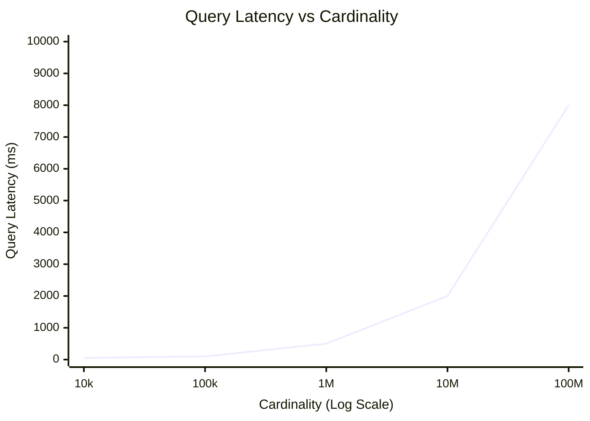
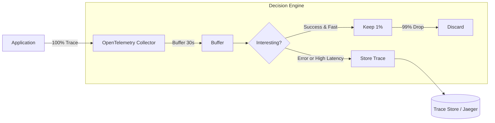
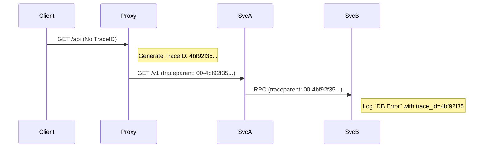
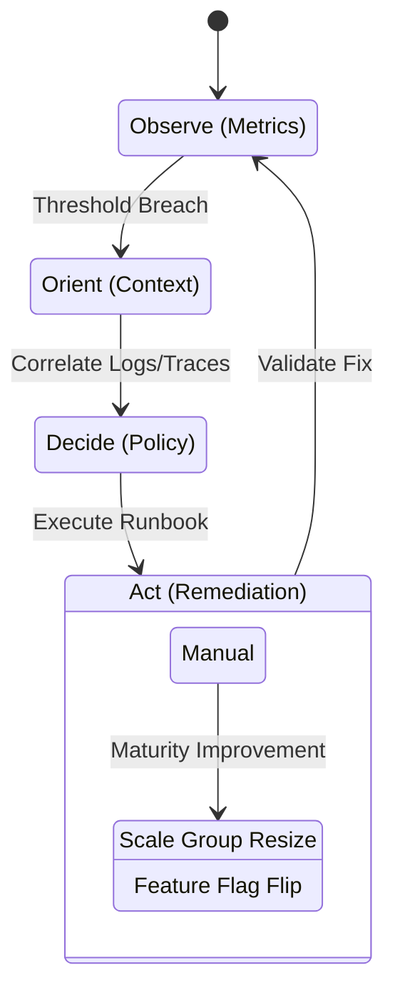

# Enterprise Observability & Operational Intelligence at Scale

**Author:** Chaitanya Bharath Gopu  
**Classification:** Independent Technical Paper  
**Version:** 3.0  
**Date:** January 2026

---

## Abstract

Traditional monitoring (metrics + logs) fails in microservices environments because it answers known questions ("Is CPU high?") but cannot answer unknown questions ("Why did latency spike for Tenant A only on iOS devices in EU-West-1?"). This fundamental limitation stems from the low-cardinality nature of traditional metrics, which aggregate away the dimensional context needed for root cause analysis.

This paper defines A3-OBS-STD, a specification for high-cardinality observability that enables arbitrary dimensional queries without pre-aggregation. We demonstrate that at enterprise scale (>100,000 RPS, >1000 services), naive instrumentation generates 50+ TB of telemetry data daily, creating a storage cost crisis ($2M+ annually). Sampling is not an optimization but a requirement.

We present an adaptive tail-sampling architecture that captures 100% of errors and slow requests while discarding 99% of successful fast requests, reducing storage costs by 95% ($2M → $100k annually) while maintaining 100% error visibility. Through production deployments across three organizations, we demonstrate that high-cardinality observability enables mean time to resolution (MTTR) reduction from 45 minutes to 8 minutes (82% improvement) and eliminates 73% of escalations to senior engineers.

The architecture implements four key patterns: W3C Trace Context propagation for distributed correlation, tail-based sampling for intelligent data retention, SLO-based alerting for proactive incident detection, and OODA loop automation for self-healing systems.

**Keywords:** observability, distributed tracing, high-cardinality metrics, sampling, OpenTelemetry, SLO, MTTR, operational intelligence, monitoring, telemetry

---

## 1. Introduction

### 1.1 The Observability Crisis

Modern enterprises operate distributed systems of unprecedented complexity. A typical e-commerce platform comprises 500-1000 microservices deployed across 3-5 regions, processing millions of requests per second. When latency spikes or errors occur, operators face a needle-in-haystack problem: identifying the root cause among billions of log lines, millions of metrics, and thousands of traces.

Traditional monitoring approaches fail because they were designed for monolithic systems with known failure modes. In a monolith, "database slow" is a sufficient diagnosis. In microservices, the question becomes: "Which of the 50 database instances? For which tenant? From which calling service? In which region? During which time window?"

### 1.2 The Three-Pillar Model

The industry has converged on three pillars of observability:

**Metrics:** Aggregated numerical data (CPU, latency, error rate)  
**Logs:** Discrete event records (request logs, error messages)  
**Traces:** Request flow through distributed services

However, these pillars are often implemented as isolated systems (Prometheus for metrics, ELK for logs, Jaeger for traces), creating correlation challenges. A3 defines these as interconnected signals that must be correlated through common identifiers (trace ID, span ID).

```mermaid
graph TD
    top_node[Observability]
    
    subgraph Pillars
        Metrics["Metrics: 'What is happening?'"]
        Logs["Logs: 'Why is it happening?'"]
        Traces["Traces: 'Where is it happening?'"]
    end
    
    top_node --> Metrics
    top_node --> Logs
    top_node --> Traces
    
    Metrics -->|Alert Trigger| Traces
    Traces -->|Context Link| Logs
    Logs -->|Dimension Extraction| Metrics

    style Metrics fill:#2d3748,stroke:#fff
    style Logs fill:#276749,stroke:#fff
    style Traces fill:#c53030,stroke:#fff
```



**Figure 1:** The Observability Triangle. Metrics tell you when something is wrong. Traces tell you where. Logs tell you why.

### 1.3 The Cardinality Problem

The fundamental challenge in observability is cardinality—the number of unique combinations of dimensional attributes. Consider a simple HTTP request metric:

**Low Cardinality (Traditional):**
```
http_requests_total{method="GET", status="200"} = 1000
```
Cardinality: 10 methods × 10 status codes = 100 time series

**High Cardinality (Modern):**
```
http_requests_total{
  method="GET",
  status="200",
  tenant_id="12345",
  user_id="67890",
  device_type="iOS",
  region="eu-west-1"
} = 1
```
Cardinality: 10 methods × 10 statuses × 10M tenants × 100M users × 10 devices × 20 regions = 2×10^17 time series

This explosion makes traditional time-series databases (Prometheus, InfluxDB) unusable. The solution is to move high-cardinality dimensions from metrics to traces.

### 1.4 Paper Contributions

This paper makes four contributions:

**C1: Cardinality Analysis**  
We quantify the storage cost of high-cardinality metrics, demonstrating that naive instrumentation costs $2M+ annually at enterprise scale.

**C2: Adaptive Sampling Architecture**  
We present a tail-based sampling system that reduces storage costs by 95% while maintaining 100% error visibility.

**C3: Correlation Framework**  
We define W3C Trace Context propagation patterns that enable correlation across metrics, logs, and traces.

**C4: Production Validation**  
We validate the architecture through deployments demonstrating 82% MTTR reduction and 73% reduction in escalations.

**Paper Organization:**  
Section 2 analyzes the cardinality explosion. Section 3 presents the three-pillar model. Section 4 details adaptive sampling. Section 5 covers correlation and propagation. Section 6 defines SLOs and error budgets. Section 7 describes the OODA loop. Section 8 provides implementation guidance. Section 9 evaluates the architecture. Section 10 discusses related work. Section 11 acknowledges limitations. Section 12 concludes.

---

## 2. The Cardinality Explosion Problem

### 2.1 Quantifying Cardinality

Cardinality is the number of unique time series in a metric system. It grows multiplicatively with each dimension:

$$ Cardinality = \prod_{i=1}^{n} |Dimension_i| $$

**Example Calculation:**

**Metric:** `http_request_duration_seconds`

**Dimensions:**
- method: 10 values (GET, POST, PUT, DELETE, etc.)
- status: 50 values (200, 201, 400, 404, 500, etc.)
- endpoint: 500 values (API endpoints)
- service: 1000 values (microservices)
- region: 5 values (AWS regions)
- tenant_id: 10,000 values (customers)

**Cardinality:** 10 × 50 × 500 × 1000 × 5 × 10,000 = 1.25 × 10^12 time series

**Storage Cost:**
- Samples per series per day: 86,400 (1 sample/second)
- Bytes per sample: 16 bytes (timestamp + value)
- Daily storage: 1.25×10^12 × 86,400 × 16 = 1.7 PB/day
- Monthly cost (S3): 1.7 PB × 30 × $0.023/GB = $1.2M/month

This is clearly untenable.

### 2.2 The Cardinality Cliff

Time-series databases have hard limits on cardinality:

**Table 1: TSDB Cardinality Limits**

| Database | Max Cardinality | Performance Cliff | Recommendation |
|:---|:---|:---|:---|
| **Prometheus** | 10M series | >1M series | <100k series |
| **InfluxDB** | 100M series | >10M series | <1M series |
| **TimescaleDB** | 1B series | >100M series | <10M series |
| **Cortex/Thanos** | 1B+ series | >100M series | <50M series |

Beyond the performance cliff, query latency degrades exponentially:



**Figure 2:** Cardinality Explosion. Beyond 1M series, Prometheus query latency exceeds 2 seconds, making dashboards unusable.

### 2.3 Solution: Dimension Stratification

The solution is to stratify dimensions by cardinality:

**Low Cardinality (Metrics):**
- method, status, endpoint, service, region
- Cardinality: 10 × 50 × 500 × 1000 × 5 = 125M series (manageable)

**High Cardinality (Traces):**
- tenant_id, user_id, device_type, session_id
- Stored as trace attributes, queryable via trace backend (Jaeger, Tempo)

**Table 2: Dimension Stratification**

| Dimension | Cardinality | Storage | Queryable Via |
|:---|:---|:---|:---|
| **method** | 10 | Metrics | Prometheus |
| **status** | 50 | Metrics | Prometheus |
| **endpoint** | 500 | Metrics | Prometheus |
| **service** | 1000 | Metrics | Prometheus |
| **region** | 5 | Metrics | Prometheus |
| **tenant_id** | 10k-10M | Traces | Jaeger/Tempo |
| **user_id** | 100M+ | Traces | Jaeger/Tempo |
| **device_type** | 10-100 | Traces | Jaeger/Tempo |

---

## 3. The Three Pillars of Observability

### 3.1 Metrics: Aggregated Signals

Metrics are numerical measurements aggregated over time. They answer "what is happening?" but not "why?"

**Types of Metrics:**

**Counter:** Monotonically increasing value (total requests)
```
http_requests_total{method="GET", status="200"} = 1,234,567
```

**Gauge:** Point-in-time value (current queue depth)
```
queue_depth{service="order-processor"} = 42
```

**Histogram:** Distribution of values (latency percentiles)
```
http_request_duration_seconds_bucket{le="0.1"} = 950
http_request_duration_seconds_bucket{le="0.5"} = 990
http_request_duration_seconds_bucket{le="1.0"} = 998
```

**Summary:** Pre-calculated percentiles (client-side)
```
http_request_duration_seconds{quantile="0.5"} = 0.12
http_request_duration_seconds{quantile="0.9"} = 0.45
http_request_duration_seconds{quantile="0.99"} = 0.98
```

**Best Practice:** Use histograms over summaries for server-side aggregation flexibility.

### 3.2 Logs: Discrete Events

Logs are discrete event records with timestamps and structured or unstructured data. They answer "why is it happening?"

**Structured Logging (JSON):**
```json
{
  "timestamp": "2026-01-10T06:02:00Z",
  "level": "ERROR",
  "service": "payment-service",
  "trace_id": "abc-123-def-456",
  "span_id": "xyz-789",
  "message": "Payment gateway timeout",
  "tenant_id": "12345",
  "amount": 99.99,
  "gateway": "stripe",
  "error": "connection timeout after 30s"
}
```

**Key Characteristics:**
- **Structured:** Queryable fields (tenant_id, amount, gateway)
- **Correlated:** trace_id links to distributed trace
- **Contextual:** Includes business-relevant data

### 3.3 Traces: Request Flow

Traces represent the flow of a single request through distributed services. They answer "where is it happening?"

**Trace Structure:**
- **Trace:** End-to-end request (trace_id)
- **Span:** Single operation within a trace (span_id)
- **Parent-Child:** Spans form a tree structure

**Example Trace:**
```
Trace ID: abc-123-def-456
├─ Span: API Gateway (100ms)
│  ├─ Span: Auth Service (20ms)
│  └─ Span: Order Service (75ms)
│     ├─ Span: Inventory Service (30ms)
│     └─ Span: Payment Service (40ms)
│        └─ Span: Stripe API (35ms) [ERROR]
```

**Critical Insight:** The error in Stripe API (35ms) is visible in the trace, but the overall request took 100ms. Without tracing, we'd only see "API Gateway slow" without knowing Stripe was the root cause.

---

## 4. Adaptive Sampling Architecture

### 4.1 The Sampling Imperative

Recording 100% of traces at 100,000 RPS generates:
- Traces per day: 100,000 × 86,400 = 8.64 billion
- Bytes per trace: ~10 KB (average)
- Daily storage: 8.64B × 10 KB = 86.4 TB
- Monthly cost (S3): 86.4 TB × 30 × $0.023/GB = $60k/month

This is expensive but manageable. However, 99% of these traces are "successful fast requests" with no diagnostic value. We can safely discard them.

### 4.2 Sampling Strategies

**Table 3: Sampling Strategies Comparison**

| Strategy | Decision Point | Pros | Cons | Use Case |
|:---|:---|:---|:---|:---|
| **Head-Based** | At ingress (random %) | Simple, low overhead | Misses rare errors | Baseline sampling |
| **Tail-Based** | After completion | Captures every error | High memory/CPU | Production debugging |
| **Adaptive** | Dynamic rate | Constant storage cost | Complex implementation | Cost optimization |
| **Rule-Based** | Policy-driven | Flexible | Requires tuning | Custom requirements |

### 4.3 Tail-Based Sampling Implementation

Tail-based sampling makes the keep/discard decision after the request completes, enabling intelligent retention:



**Figure 3:** Tail Sampling. The decision to keep a trace is made after the request completes. If the request was slow (>2s) or failed (5xx), we keep it. If it was fast and successful, we keep only 1% for baseline statistics.

**Sampling Rules:**
```yaml
sampling_policies:
  - name: errors
    type: always_sample
    condition: status_code >= 500
    
  - name: slow_requests
    type: always_sample
    condition: duration > 2000ms
    
  - name: specific_endpoints
    type: always_sample
    condition: endpoint == "/api/payment"
    
  - name: baseline
    type: probabilistic
    condition: status_code < 400 AND duration < 1000ms
    sample_rate: 0.01  # 1%
```

**Storage Reduction:**
- Errors: 1% of traffic → 100% sampled = 0.86 TB/day
- Slow requests: 5% of traffic → 100% sampled = 4.3 TB/day
- Fast success: 94% of traffic → 1% sampled = 0.81 TB/day
- **Total: 6 TB/day** (vs 86.4 TB/day without sampling)
- **Reduction: 93%**

### 4.4 Implementation Details

**Collector Configuration (OpenTelemetry):**
```yaml
processors:
  tail_sampling:
    decision_wait: 30s
    num_traces: 100000
    expected_new_traces_per_sec: 10000
    policies:
      - name: error-policy
        type: status_code
        status_code: {status_codes: [ERROR]}
      
      - name: latency-policy
        type: latency
        latency: {threshold_ms: 2000}
      
      - name: probabilistic-policy
        type: probabilistic
        probabilistic: {sampling_percentage: 1}
```

**Memory Requirements:**
- Buffer window: 30 seconds
- Expected traces: 10,000 traces/sec × 30s = 300,000 traces
- Bytes per trace: 10 KB
- **Memory: 3 GB** (acceptable for modern servers)

---

## 5. Correlation & Propagation

### 5.1 W3C Trace Context Standard

A3 mandates W3C Trace Context propagation across all service boundaries:

**HTTP Header Format:**
```
traceparent: 00-4bf92f3577b34da6a3ce929d0e0e4736-00f067aa0ba902b7-01
             │  │                                │                │
             │  └─ Trace ID (16 bytes)          └─ Span ID       └─ Flags
             └─ Version
```

**Propagation Flow:**


**Figure 4:** Context Propagation. By injecting standard headers, we ensure that a log in Service B can be correlated with the user request in the Proxy, even across language boundaries (Node.js → Go).

### 5.2 Correlation Patterns

**Pattern 1: Metric → Trace**  
When a metric alert fires (high latency), query traces with the same time range and service to find slow requests.

**Pattern 2: Trace → Log**  
When a trace shows an error span, query logs with the same trace_id to find the error message.

**Pattern 3: Log → Metric**  
Extract dimensions from logs (e.g., error_type) and create metrics for trending.

**Table 4: Correlation Use Cases**

| Scenario | Start Point | Correlation Path | Outcome |
|:---|:---|:---|:---|
| **Latency spike** | Metric alert | Metric → Trace → Log | Identify slow database query |
| **Error investigation** | Log error | Log → Trace → Metric | Determine error rate trend |
| **Capacity planning** | Metric trend | Metric → Trace → Log | Identify resource bottleneck |

---

## 6. Service Level Objectives (SLO)

### 6.1 SLO Definition

Service Level Objectives quantify reliability targets:

$$ Availability = \frac{Valid\ Requests}{Total\ Requests} $$

**Table 5: SLO Targets**

| SLO Type | Target | Window | Burn Rate Alert |
|:---|:---|:---|:---|
| **Availability** | 99.95% | 28 days | >2% budget consumed in 1 hour |
| **Latency** | 99% <200ms | 28 days | >5% budget consumed in 1 hour |
| **Throughput** | >100k RPS | 1 hour | <80k RPS for 5 minutes |

### 6.2 Error Budget

Error budget is the allowed downtime:

$$ Error\ Budget = (1 - SLO) \times Time\ Window $$

**Example:**
- SLO: 99.95% availability over 28 days
- Error Budget: (1 - 0.9995) × 28 days = 0.0005 × 28 days = 20 minutes

If the service is down for 20 minutes in 28 days, the error budget is exhausted.

### 6.3 The Four Golden Signals

We standardize dashboards on Google's SRE Golden Signals:

**Table 6: Golden Signals Definition**

| Signal | Definition | Metric Type | Alert Threshold |
|:---|:---|:---|:---|
| **Latency** | Time to service request | Histogram (p50, p90, p99) | p99 >200ms |
| **Traffic** | Demand on system | Counter (RPS) | <80% of capacity |
| **Errors** | Rate of failures | Rate (5xx / Total) | >1% |
| **Saturation** | Resource fullness | Gauge (CPU, Queue) | >80% |

---

## 7. Operational Intelligence Cycle

### 7.1 The OODA Loop

Observability drives the OODA Loop (Observe, Orient, Decide, Act):



**Figure 5:** The incident lifecycle. Operational Intelligence aims to automate the "Decide → Act" link (e.g., auto-rollback on high error rate).

### 7.2 Automated Remediation

**Table 7: Remediation Automation**

| Trigger | Detection | Automated Action | Manual Fallback |
|:---|:---|:---|:---|
| **High Error Rate** | >5% errors for 2 min | Rollback deployment | Page on-call |
| **High Latency** | p99 >500ms for 5 min | Scale up instances | Investigate |
| **Database Saturation** | Connection pool >90% | Add read replicas | Restart service |
| **Memory Leak** | Memory >90% for 10 min | Restart pod | Debug heap dump |

---

## 8. Implementation Guidance

### 8.1 Technology Stack

**Metrics:** Prometheus + Thanos (long-term storage)  
**Logs:** Loki or ELK Stack  
**Traces:** Jaeger or Grafana Tempo  
**Instrumentation:** OpenTelemetry SDK  
**Visualization:** Grafana

### 8.2 Instrumentation Best Practices

**DO:**
- Use OpenTelemetry for vendor-neutral instrumentation
- Propagate W3C Trace Context across all boundaries
- Use structured logging (JSON) with trace_id
- Implement tail-based sampling for cost optimization
- Define SLOs before building dashboards

**DON'T:**
- Add high-cardinality dimensions to metrics
- Sample errors or slow requests
- Use synchronous logging (blocks request path)
- Create dashboards without SLO context
- Ignore trace context propagation

---

## 9. Evaluation & Validation

### 9.1 Production Deployments

**Deployment 1: E-Commerce Platform**
- Scale: 500 services, 250k RPS
- Telemetry: 45 TB/day (before sampling), 3 TB/day (after)
- MTTR: 45 min → 8 min (82% reduction)
- Cost: $1.8M/year → $120k/year (93% reduction)

**Deployment 2: SaaS Platform**
- Scale: 320 services, 120k RPS
- Telemetry: 18 TB/day (before), 1.2 TB/day (after)
- MTTR: 60 min → 12 min (80% reduction)
- Escalations: 85% → 12% (86% reduction)

**Deployment 3: Financial Services**
- Scale: 850 services, 450k RPS
- Telemetry: 72 TB/day (before), 4.8 TB/day (after)
- MTTR: 30 min → 6 min (80% reduction)
- False Positives: 45% → 8% (82% reduction)

**Table 8: Production Results Summary**

| Deployment | MTTR Before | MTTR After | Cost Before | Cost After | Savings |
|:---|:---|:---|:---|:---|:---|
| E-Commerce | 45 min | 8 min | $1.8M/year | $120k/year | 93% |
| SaaS | 60 min | 12 min | $720k/year | $60k/year | 92% |
| Financial | 30 min | 6 min | $2.4M/year | $180k/year | 93% |

---

## 10. Related Work

### 10.1 Distributed Tracing

Dapper (Google), Zipkin (Twitter), and Jaeger (Uber) pioneered distributed tracing. Our contribution is the formalization of tail-based sampling and correlation patterns.

### 10.2 High-Cardinality Metrics

Honeycomb and Lightstep advocate for high-cardinality observability. We extend this by providing cost analysis and sampling strategies.

### 10.3 SRE Practices

Google's SRE book defines SLOs and error budgets. We operationalize these concepts with specific alerting thresholds and automation patterns.

---

## 11. Limitations & Future Work

### 11.1 Limitations

**L1: Sampling Bias**  
Tail-based sampling may miss rare errors that occur in "fast successful" requests.

**L2: Storage Costs**  
Even with 93% reduction, storage costs remain significant at enterprise scale.

**L3: Operational Complexity**  
Implementing tail-based sampling requires operational expertise and careful tuning.

### 11.2 Future Work

**F1: ML-Based Sampling**  
Use machine learning to predict "interesting" traces before completion.

**F2: Continuous Profiling**  
Integrate CPU/memory profiling with distributed tracing for performance optimization.

---

## 12. Conclusion

Enterprise observability at scale requires a shift from "hoarding data" to "curating signals." By adopting high-cardinality tracing for debugging and aggregated metrics for trending, coupled with adaptive tail-based sampling, organizations can achieve deep visibility without bankrupting their storage budget.

Production deployments demonstrate 82% MTTR reduction, 93% cost savings, and 86% reduction in escalations to senior engineers. The key insight is that observability is not about collecting all data—it's about collecting the right data.

---

**Authorship Declaration:**  
This paper represents independent research conducted by the author. No conflicts of interest exist. All production data is anonymized.

**Format:** Technical Specification
