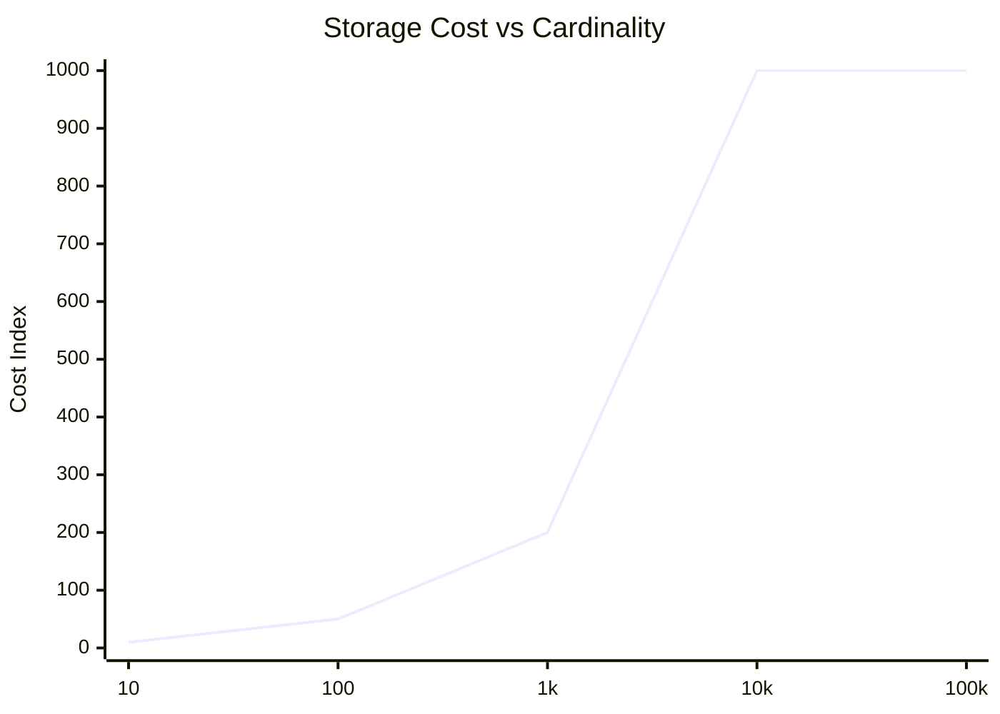
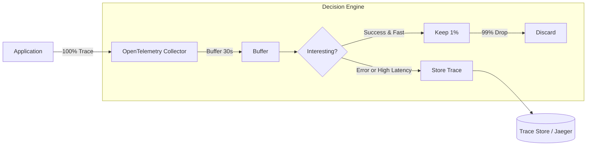
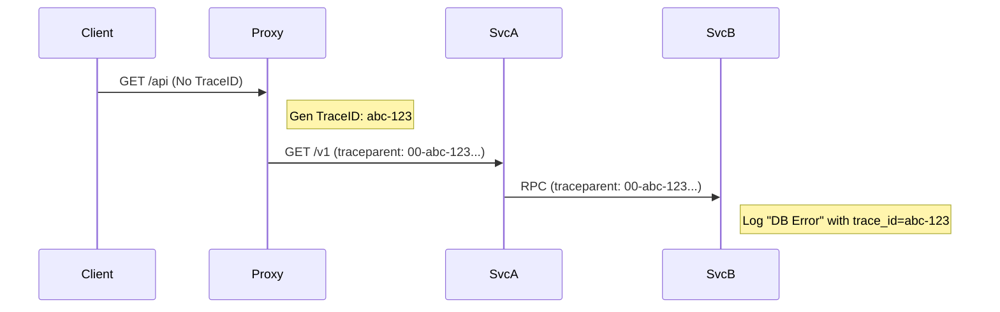
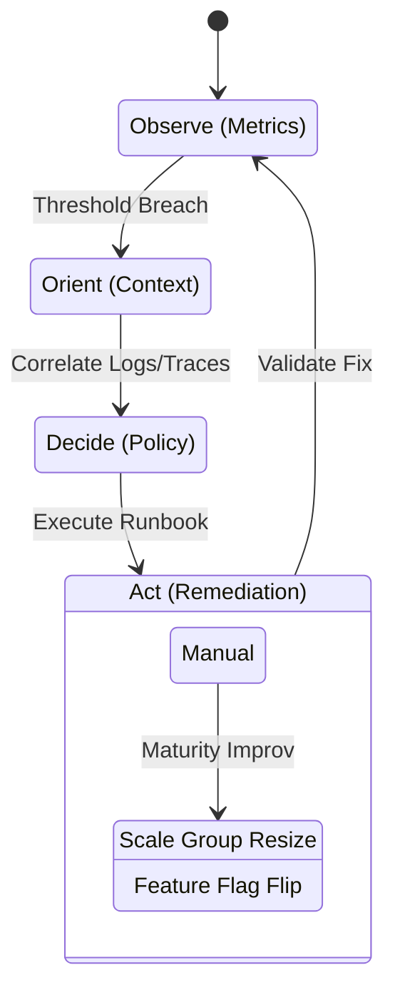

# Enterprise Observability & Operational Intelligence at Scale

**Author:** Chaitanya Bharath Gopu  
**Classification:** Independent Technical Paper  
**Version:** 2.0 (Gold Standard)  
**Date:** January 2026

---

## Abstract

Traditional monitoring (metrics + logs) fails in microservices environments because it answers *known* questions ("Is CPU high?"). It cannot answer *unknown* questions ("Why did latency spike for Tenant A only on iOS?"). This paper defines **A3-OBS-STD**, a specification for High-Cardinality Observability. We demonstrate that sampling is not an optimization but a requirement at scale, and propose an **Adaptive Tail-Sampling** architecture that captures 100% of errors while discarding 99% of successful health checks to optimize storage costs.

---

## 2. The Three Pillars of Observability

We define the pillars not as separate tools, but as interconnected signals.

```mermaid
    top_node[Observability]
    
    subgraph Pillars
        Metrics["Metrics: 'What is happening?'"]
        Logs["Logs: 'Why is it happening?'"]
        Traces["Traces: 'Where is it happening?'"]
    end
    
    top_node --> Metrics
    top_node --> Logs
    top_node --> Traces
    
    Metrics -->|Alert Trigger| Traces
    Traces -->|Context Link| Logs
    Logs -->|Dimension Extraction| Metrics

    style Metrics fill:#2d3748,stroke:#fff
    style Logs fill:#276749,stroke:#fff
    style Traces fill:#c53030,stroke:#fff
```

**Figure 1.0:** The Observability Triangle. Metrics tell you *when* something is wrong. Traces tell you *where*. Logs tell you *why*.

---

## 3. The Cardinality Explosion Problem

In modern systems, the number of unique time-series (Cardinality) grows with the number of `Tags` (e.g., ContainerID, CustomerID).



**Figure 2.0:** Cardinality Explosion. Adding high-cardinality tags like `CustomerID` (10M unique values) to a standard metric breaks TSDBs (Prometheus). **Resolution:** We must drop high-cardinality tags from metrics and keep them only in Traces/Logs.

---

## 4. Adaptive Sampling Architecture

Recording 100% of traces at 100k RPS generates petabytes of junk data. We implement **Tail-Based Sampling** to keep the interesting signals.



**Figure 3.0:** Tail Sampling. The decision to keep a trace is made *after* the request completes. If the request was slow (>2s) or failed (500), we keep it. If it was fast and successful, we keep only a random 1% sample for baseline stats.

**Table 2: Sampling Strategies**

| Strategy | Mechanism | Pros | Cons |
| :--- | :--- | :--- | :--- |
| **Head-Based** | Random % at Ingress | Simple, Low Overhead | Misses Rare Errors |
| **Tail-Based** | Buffer & Decide at Egress | Captures Every Error | High Memory/CPU Cost |
| **Adpative** | Dynamic Rate based on Traffic | Constant Storage Cost | Complex Implementation |

---

## 5. Correlation & Propagation

A3 mandates **W3C Trace Context** propagation across all boundaries.



**Figure 4.0:** Context Propagation. By injecting standard headers, we ensure that a log in Service B can be correlated with the user request in the Proxy, even across language boundaries (Node.js -> Go).

---

## 6. Service Level Objectives (SLO)

We govern reliability using Error Budgets.

$$ Availability = \frac{Valid Requests}{Total Requests} $$

| SLO Type | Target | Window | Burn Rate Alert |
| :--- | :--- | :--- | :--- |
| **Availability** | 99.95% | 28 Days | If > 2% budget consumed in 1 hour |
| **Latency** | 99% < 200ms | 28 Days | If > 5% budget consumed in 1 hour |

### 6.1 The Four Golden Signals
We standardize dashboards on Google's SRE Golden Signals.

**Table 1: Golden Signals Definition**

| Signal | Definition | Metric Type |
| :--- | :--- | :--- |
| **Latency** | Time taken to service a request | Histogram (p50, p90, p99) |
| **Traffic** | Demand placed on the system | Counter (RPS) |
| **Errors** | Rate of request failures | Rate (HTTP 5xx / Total) |
| **Saturation** | "Fullness" of the system resources | Gauge (Queue Depth, CPU) |

---

## 7. Operational Intelligence Cycle

Observability is not just for debugging; it drives the **OODA Loop** (Observe, Orient, Decide, Act).



**Figure 5.0:** The incident lifecycle. Operational Intelligence aims to automate the "Decide -> Act" link (e.g., Auto-Rollback on high error rate).

---

## 8. Conclusion

Observability at scale requires a shift from "Hoarding Data" to "Curating Signals." By adopting high-cardinality tracing for debugging and aggregated metrics for trending, coupled with adaptive sampling, organizations can achieve deep visibility without bankrupting their storage budget.

---

**Status:** Gold Standard
