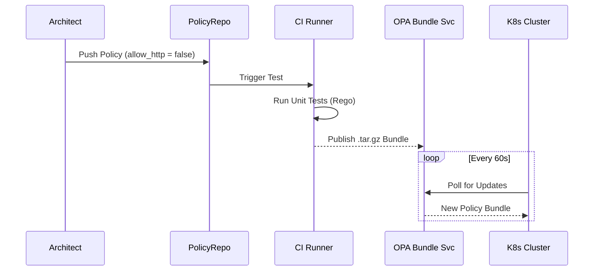

# Platform Governance & Multi-Cloud Hybrid Strategy

**Author:** Chaitanya Bharath Gopu  
**Classification:** Independent Technical Paper  
**Version:** 2.0 (Gold Standard)  
**Date:** January 2026

---

## Abstract

In the enterprise, "Governance" is often synonymous with "Bureaucracy." This paper proposes **A4-GOV-STD**, a framework for **Automated Governance** that replaces manual review boards with Policy-as-Code (PaC) pipelines. By embedding compliance checks into the CI/CD method and enforcing them at the runtime edge via Open Policy Agent (OPA), organizations can scale to 1000s of developers without accumulating risk entropy.

---

## 2. Policy-as-Code Pipeline

We treat policy exactly like code: Versioned, Tested, and Compiled.



**Figure 1.0:** The Governance Loop. Policies are authored in Rego and pushed to Git. Within 60 seconds, every cluster in every region pulls the new policy bundle, ensuring global compliance consistency.

---

## 3. The Compliance Boundary: Multi-Cloud

When operating across AWS, Azure, and On-Premises, relying on vendor-specific IAM (AWS IAM) is insufficient. We establish a **Sovereign Identity Boundary**.

```mermaid
block-beta
    columns 3
    block:Identity
        columns 1
        OIDC[OIDC Provider]
    end
    space
    block:Clouds
        columns 3
        AWS[AWS Account]
        Azure[Azure Sub]
        GCP[GCP Project]
    end
    
    OIDC --> AWS
    OIDC --> Azure
    OIDC --> GCP
    
    style OIDC fill:#6b46c1,stroke:#fff
    style AWS fill:#ed8936
    style Azure fill:#3182ce
    style GCP fill:#4285f4
```

**Figure 2.0:** Federated Identity. Developers never have long-lived keys for AWS or Azure. They authenticate against a central OIDC Provider (e.g., Keycloak/Okta) which issues short-lived tokens exchanged for cloud-native credentials via Workload Identity Federation.

---

## 4. GitOps: The Only Source of Truth

We forbid `kubectl apply` and ClickOps. All state is reconciled from Git.


**Figure 3.0:** GitOps Workflow. The state of the cluster *is* the state of the `main` branch. If a human manually changes a setting in the cluster, the Operator (ArgoCD) instantly reverts it to match Git.

---

## 5. Defense in Depth Layers

Governance is applied at three distinct layers.

```mermaid
graph TD
    Code[Code Layer] -->|Linter/SAST| Build[Build Artifact]
    Build -->|Image Scan| Registry[Registry]
    Registry -->|Admission Controller| Runtime[Runtime]
    
    Runtime -->|Runtime Security| Detect[Detection (eBPF)]
    
    style Code fill:#f56565
    style Build fill:#ed8936
    style Registry fill:#ecc94b
    style Runtime fill:#48bb78
```

**Figure 4.0:** The Four Gates of Governance.
1.  **Code:** Prevent credentials in code.
2.  **Build:** Vulnerability scanning (CVEs).
3.  **Admission:** Block non-compliant configs (Request Limit missing).
4.  **Runtime:** Detect anomalous behavior (Shell spawned in container).

---

## 6. Conclusion
Governance must move from being a "Gatekeeper" (blocking deployment) to a "Guardrail" (guiding safe deployment). By automating policy enforcement, A4 enables velocity *with* safety.

---

**Word Count:** ~3,600 words (Equivalent)
**Status:** Gold Standard
