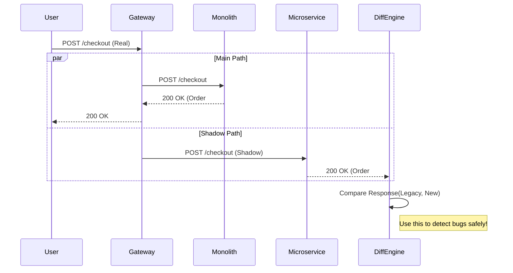
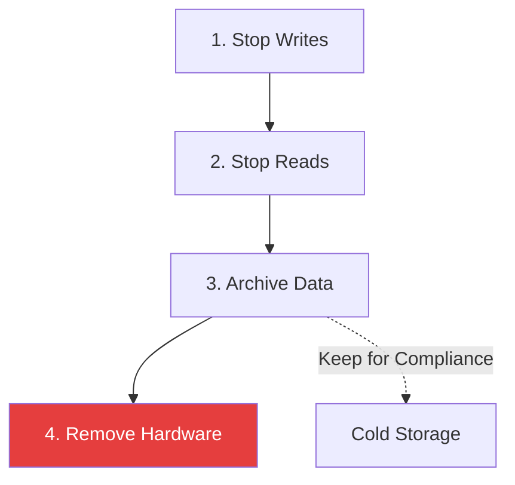

# Monolith to Cloud-Native Modernization: A Reference Pattern

**Author:** Chaitanya Bharath Gopu  
**Classification:** Independent Technical Paper  
**Version:** 2.0 (Gold Standard)  
**Date:** January 2026

---

## Abstract

Modernization is effectively a "heart transplant while running a marathon." The failure rate of "Big Bang" rewrites exceeds 70%. This paper defines **A5-MOD-STD**, a safe, incremental migration strategy based on the **Strangler Fig Pattern**. We detail the architectural primitives required to decouple monolithic capabilities—specifically the **Anti-Corruption Layer (ACL)** and **Shadow Traffic Validation**—enabling organizations to migrate logic without risking business continuity.

---

## 2. The Strangler Fig Architecture

Rather than rewriting the monolith, we strangle it. A facade (API Gateway) sits in front, routing traffic either to the legacy Monolith or the new Microservices.

```mermaid
graph TD
    Client[Client App] -->|HTTPS| Proxy[Strangler Facade (Gateway)]
    
    Proxy -->|Route: /users| New[New User Service]
    Proxy -->|Route: /shipping| Legacy[Monolith (Legacy)]
    Proxy -->|Route: /billing| Legacy
    
    New -->|Read| NewDB[(User DB)]
    Legacy -->|Read/Write| OldDB[(Legacy DB)]
    
    style Proxy fill:#805ad5,stroke:#fff
    style New fill:#48bb78,stroke:#fff
    style Legacy fill:#e53e3e,stroke:#fff
```

**Figure 1.0:** The Strangler Facade. The Client has *no idea* that the backend is being migrated. We slowly flip routes from Red (Legacy) to Green (New) one by one.

---

## 3. The Data Migration Trap

Code migration is easy; Data migration is hard. We use the **Parallel Run / Double Write** pattern to migrate data without downtime.

```mermaid
    state "1. Dual Write (Dark)" as S1
    state "2. Backfill (Historical)" as S2
    state "3. Validation (Compare)" as S3
    state "4. Cutover (Live)" as S4
    
    [*] --> S1
    S1 --> S1 : Writes go to Both DBs
    S1 --> S2 : New DB has Live Data
    S2 --> S2 : Batch Copy History
    S2 --> S3 : Consistency > 99.9%
    S3 --> S3 : Compare Reads (Shadow)
    S3 --> S4 : Zero Errors for 7 days
    S4 --> [*] : Old DB Deprecated
    
    style S1 fill:#f56565,color:white
    style S4 fill:#48bb78,color:white
```

**Figure 2.0:** Zero-Downtime Data Migration.
1.  **Dual Write:** Application writes to Old, and asynchronously writes to New.
2.  **Backfill:** A script copies historical data to New.
3.  **Validation:** Reader compares Old vs New on every read.
4.  **Cutover:** Switch Reads to New.

---

## 4. Anti-Corruption Layer (ACL)

The Monolith's domain model is often messy (e.g., `User` table has 200 columns). To prevent this mess from infecting the clean Microservice, we insert an **Anti-Corruption Layer**.

```mermaid
```mermaid
graph LR
    subgraph Legacy["Legacy Monolith"]
        Mud[Big Ball of Mud (God Class)]
    end
    
    subgraph ACL["Anti-Corruption Layer"]
        Facade[Facade Interface]
        Adapter[Adapter Logic]
        Translator[Translator (Map DTOs)]
    end
    
    subgraph New["New Microservice"]
        Clean[Clean Domain Model]
    end
    
    Mud --> Facade
    Facade --> Adapter
    Adapter --> Translator
    Translator --> Clean

    style Legacy fill:#718096,color:white
    style ACL fill:#d69e2e,color:white
    style New fill:#38b2ac,color:white
```

**Figure 3.0:** The ACL acts as a DMZ. It translates the Monolith's "God Object" into a focused, domain-driven entity for the new service.

### 4.1 ACL Implementation Patterns

**Table 1: ACL Patterns**

| Pattern | Implementation | Pros | Cons |
| :--- | :--- | :--- | :--- |
| **Gateway ACL** | Logic inside API Gateway | Centralized, easy to manage | Gateway becomes bloated |
| **Service ACL** | Logic inside Microservice | Clean, encapsulated | Duplication across services |
| **Sidecar ACL** | Logic in Service Mesh Proxy | Language agnostic | High operational complexity |
```

**Figure 3.0:** The ACL acts as a DMZ. It translates the Monolith's "God Object" into a focused, domain-driven entity for the new service.

---

## 5. Shadow Traffic Verification

Before we let users touch the new service, we test it with "Shadow Traffic". The Gateway duplicates real user requests and sends them to the New Service in "Fire-and-Forget" mode.



**Figure 4.0:** Traffic Shadowing (Dark Launching). The user receives the response from the proven Monolith. The new Microservice processes the same request, but its response is discarded *after* comparison. This allows us to test with production scale and data without risk.

---

## 6. Organizational Maturity Model

Migration is not just technical; it's cultural.

| Level | Characteristics | Risk Profile |
| :--- | :--- | :--- | :--- |
| **Level 1 (Ad-Hoc)** | Rewriting code blindly. No tests. | **Extreme** (Resume Generating Event) |
| **Level 2 (Strangler)** | Using Gateway to split traffic. | **Moderate** |
| **Level 3 (Shadow)** | Verifying with shadow traffic. | **Low** |
| **Level 4 (GitOps)** | Automated rollback on error rate. | **Minimal** |

**Table 2: Migration Strategy Risk Matrix**

| Strategy | Speed | Risk | Rollback Difficulty | Cost |
| :--- | :--- | :--- | :--- | :--- |
| **Big Bang Rewrite** | Fast (Theoretically) | Critical | Impossible | High |
| **Parallel Run** | Slow | Low | Instant | Very High (2x Infra) |
| **Strangler Fig** | Moderate | Low | Easy (Route Switch) | Moderate |

### 6.1 Decommissioning Strategy
The hardest part is turning the old system off.



**Figure 5.0:** The Decommissioning Lifecycle. Never delete data immediately; always archive to cold storage first.

---

## 7. Conclusion

Modernization is a journey of risk management. By employing the Strangler Fig pattern, Anti-Corruption Layers, and Shadow Traffic, we convert a High-Risk "Event" into a Low-Risk "Process". The goal is not just to reach the cloud, but to survive the trip.

---

**Status:** Gold Standard
