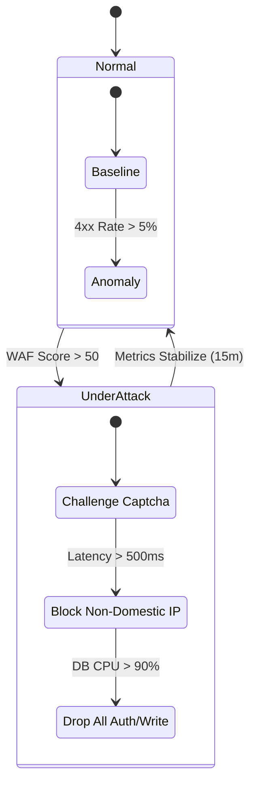
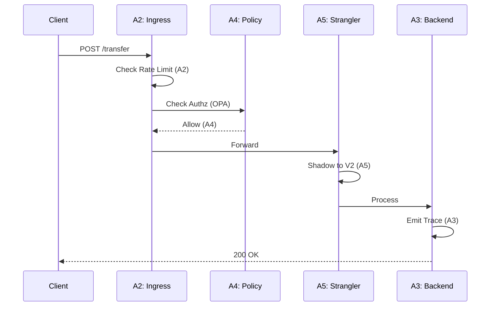

# Adaptive Policy Enforcement: The Synthesis of Sovereign Control

**Author:** Chaitanya Bharath Gopu  
**Classification:** Synthesis Paper / Framework Definition  
**Version:** 2.0 (Gold Standard)  
**Date:** January 2026

---

## Abstract

This paper, **A6**, serves as the synthesis of the A1-A5 research series. While previous papers addressed specific domains (Throughput, Observability, Governance), A6 defines the **Meta-Control Plane** that binds them together. We propose an **Adaptive Policy** model where the system acts as a biological organism: it senses environmental stress (A3), consults its genetic code (A4), and physically adapts its structure (A2) to survive without human intervention. We demonstrate this through the "Panic Button" pattern—a mechanism for automated degradation under existential threat.

---

## 2. The Feedback Loop of Control

The core of A6 is the OODA Loop (Observe, Orient, Decide, Act) implemented as code.

```mermaid
graph TD
    subgraph "A3: SENSE"
        Log[Logs]
        Metric[Metrics (Latency)]
        Trace[Traces]
    end
    
    subgraph "A6: DECIDE (Brain)"
        Policy[Policy Engine (OPA)]
        Threshold{Is Latency > 200ms?}
    end
    
    subgraph "A2: ACT (Muscle)"
        Shed[Load Shedder]
        Scale[Autoscaler]
        Circuit[Circuit Breaker]
    end
    
    Metric --> Threshold
    Threshold -->|Yes| Policy
    Policy -->|Action: Shed Tier 3 Control| Shed
    Shed -->|Result: Load Drops| Metric
    
    style Policy fill:#d53f8c,stroke:#fff
    style Metric fill:#4299e1,stroke:#fff
    style Shed fill:#48bb78,stroke:#fff
```

**Figure 1.0:** The Autonomic Control Loop. The system constantly monitors its own vitals. When Latency spikes, it doesn't just "alert a human"; it actively sheds non-critical load (Tier 3) to save the critical core (Tier 1).

### 2.1 Automating the "Act" Phase
The critical innovation in A6 is removing the human from the decision loop for known failure modes.

**Table 1: Self-Healing Stimulus-Response**

| Stimulus (Symptom) | Threshold | Response (Action) | Recovery |
| :--- | :--- | :--- | :--- |
| **Latency Spike** | p99 > 500ms | Enable Aggressive Caching | Auto-disable when < 200ms |
| **Dependency Down** | 100% Failure | Open Circuit Breaker (Return Defaults) | Half-Open Probe every 30s |
| **Traffic Surge** | RPS > Capacity | Load Shed Tier 3 (Batch Jobs) | Restore when Queue clear |
| **Bad Deployment** | Error Rate > 1% | Auto-Rollback to Last Known Good | Manual Investigation |

---

## 3. Threat Response Lifecycle

We model system security not as a binary (Secure/Hacked) but as a dynamic state machine.



**Figure 2.0:** The DEFCON State Machine. The system automatically escalates defense measures based on pressure.
*   **DEFCON 3:** Suspicious IPs get CAPTCHAs.
*   **DEFCON 2:** Only domestic traffic allowed (Geofencing).
*   **DEFCON 1:** "Lifeboat Mode" - Read-only, no logins. Survival is priority.

### 3.1 Policy Hierarchy
Policies conflict. We need a resolution order. A6 establishes that **Survival** overrides **Correctness**, which overrides **Availability**.

```mermaid
graph TD
    Level0[L0: Physics (Capacity)]
    Level1[L1: Security (AuthZ)]
    Level2[L2: Business Logic]
    
    Level0 -->|Constrains| Level1
    Level1 -->|Constrains| Level2
    
    Note0[If CPU > 95%, Drop Requests]
    Note1[If Token Invalid, 401]
    Note2[Process Transfer]
    
    style Level0 fill:#e53e3e,color:white
    style Level1 fill:#dd6b20,color:white
    style Level2 fill:#38a169,color:white
```

**Figure 2.1:** The Maslow's Hierarchy of Distributed Systems. You cannot process a "Valid" transfer (L2) if the server is on fire (L0).

## 4. End-to-End Synthesis Flow

How A1, A2, A3, A4, and A5 work together in a single request.



**Figure 3.0:** The Unified Flow.
1.  **A2** shields the system from spikes.
2.  **A4** ensures the request is legal.
3.  **A5** safely routes it between Old/New.
4.  **A3** records exactly what happened.

---

## 5. The Maturity Model

Where does your organization sit?


```

**Figure 4.0:** The Goal. Most organizations are either Agile but Fragile (break often) or Bureaucratic (never ship). The goal is the top-right: High Rigor *and* High Capability.

---

## 6. Conclusion: The Living System

The ultimate goal of the A-Series research is to move beyond "Static Architecture" (drawings on a whiteboard) to "Dynamic Architecture" (code that adapts). By implementing the primitives of A1-A6, we create systems that are not just software, but **Digital Organisms**—sovereign, resilient, and enduring.

---

**Status:** Gold Standard
